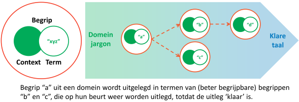

# Overzicht

Dit hoofdstuk schetst de hoofdlijnen en belangrijkste inzichten van BP4mc2. Voor de lezer met beperkte tijd biedt het een handige samenvatting van deze website. De lezer die geïnteresseerd is in een specifiek onderwerp, kan dit hoofdstuk gebruiken als kapstok voor de onderwerpen die in de detailhoofdstukken 3 tot en met 6 worden behandeld.

## Linked Data
'Linked Data' is een techniek waarmee data via het internet worden gepubliceerd. Daarbij worden dingen in de echte wereld gerepresenteerd door een uniforme identificatie op het internet. Daarmee kunnen mensen via het internet informatie over die dingen vinden.

## Drie werkelijkheden
In BP4mc2 gaan we in op drie verschillende 'werkelijkheden'. De 'echte' wereld noemen we de "natuurlijke werkelijkheid": de werkelijkheid waarin natuurwetten gelden en die we als mensen 'natuurlijk' vinden. De informatiesystemen met hun data en applicaties noemen we de “administratieve werkelijkheid”. En de afspraken die we met elkaar maken (in wet– en regelgeving, als mondelinge afspraken of in standaarden) noemen we de "institutionele werkelijkheid".

In de natuurlijk werkelijkheid communiceert of abstraheert een persoon (actor) over een concreet ding. Een actor vormt een gedachte over dat ding. Op basis van die gedachte verbindt de actor het ding met een term die dat ding aanduidt. Als actoren elkaar begrijpen hebben ze bij één dezelfde term (ongeveer) dezelfde gedachte aan hetzelfde ding. De natuurlijke werkelijkheid is continu in beweging, er gebeurt van alles, dit zijn levensgebeurtenissen.

In de institutionele werkelijkheid leggen instituten hun visie (bedoeling) op een bepaald domein vast. Dingen in de natuurlijke werkelijkheid worden in de institutionele werkelijkheid geformaliseerd als feiten. Feiten worden vastgelegd in formele termen die samen een wet, een standaard of andere institutionele afspraak vormen. Een levensgebeurtenis in de natuurlijke werkelijkheid wordt geformaliseerd als één of meerdere institutionele gebeurtenissen in de institutionele werkelijkheid, bijvoorbeeld in de vorm van rechtshandelingen.

In de administratieve werkelijkheid worden deze juridische termen als linked data geordend in triples. Triples zijn korte zinnen, waarmee een uitspraak wordt vastgelegd in de vorm van "onderwerp – gezegde – (lijdend) voorwerp". Onderwerp en lijdend voorwerp hebben daarbij een op het internet vindbare naam in de vorm van een URI. Daardoor wordt het mogelijk data over feiten, dingen en gebeurtenissen uit een bepaalde bron te verbinden met data uit andere bronnen. Het is een open structuur, die vaak wordt benoemd met het 'triple A' adagium 'Anybody can say Anything about Anything'. Daar hoort dan wel bij dat het belangrijk is om te zien wat de herkomst is van een uitspraak.

BP4mc2 laat zien hoe met Linked Data de natuurlijke werkelijkheid verbonden kan worden met de institutionele werkelijkheid en hoe dit alles gerepresenteerd kan worden in een administratieve werkelijkheid waarin data over feiten en gebeurtenissen uit de verschillende werkelijkheden worden verbonden.

## Samenhang tussen de drie werkelijkheden

Een levensgebeurtenis (bijvoorbeeld de geboorte van een kind) is aanleiding voor een institutionele gebeurtenis (in dit geval bijvoorbeeld het feit dat het kind een bepaalde nationaliteit heeft). Van een dergelijk feit kan slechts sprake zijn als voldaan wordt aan bepaalde voorwaarden.

Om de administratie van het feit op orde te krijgen, bestaan procesafspraken zodat een actor in de natuurlijke werkelijkheid ervoor zorgt dat ook een administratieve gebeurtenis optreedt (in dit geval de registratie van de geboorte van het kind bij de gemeente). De administratieve gebeurtenis heeft als eindresultaat dat bepaalde data wordt vastgelegd, zoals de geboortedatum van het kind, zijn of haar geslacht en de gegevens van de persoon die aangifte doet van de geboorte. Er is sprake van een compliant situatie, als de administratieve vastlegging overeen komt met de situatie die volgens de regels van de institutionele werkelijkheid zouden moeten gelden.

## Axiomatisch begrippenstelsel

Om elkaar te kunnen begrijpen, is het nodig dat je weet wat de begrippen betekenen die een ander gebruikt. Begrippen hebben een 'naam': de term, de aaneenschakeling van woorden, die je gebruiken als je dit begrip bedoelt. Omdat je dezelfde naam kunt gebruikt in verschillende situaties, is het nodig om bij de uitleg van een begrip ook altijd aan te geven in welke situatie deze term de naam is voor het begrip dat je wilt uitleggen. Zo'n situatie noemen wij een "context".

Om begrippen in onderlinge samenhang te beschrijven hanteren we een axiomatisch begrippenstelsel. In een axiomatisch begrippenstelsel wordt ieder begrip beschreven in termen van een ander begrip. Daarbij kom je uiteindelijk uit bij enkele begrippen die iedereen in deze context begrijpt en niet worden uitgelegd. Dit noemen we axioma's.

Doel van het begrippenstelsel is uiteraard om alle begrippen in het model "begrijpelijk" te maken. Cirkelredenaties, waarbij in de definitie van een begrip andere begrippen worden gebruikt die – direct of indirect – weer gebruik maken van het te definiëren begrip zijn 'oneerlijk'. Dat geeft geen begrip, maar leidt tot een eindeloze rondgang.

Een begrippenstelsel dat op een dergelijke manier is opgebouwd verbindt de uit te leggen begrippen met de begrippen die iemand al begrijpt. Het verbindt de argeloze lezer vanuit zijn eigen belevingswereld en vocabulaire met het domein en de domeinvocabulaire die begrepen moet worden.
