# Denkwijze

Begrip, in de zin van elkaar begrijpen staat centraal bij communicatie. Alleen als mensen elkaar begrijpen kunnen ze met elkaar communiceren en raken ze verbonden. Hetzelfde geldt voor communicatie tussen informatiesystemen. Alleen als data in informatiesystemen begrijpelijk is, kunnen informatiesystemen met elkaar communiceren en kan hun data worden verbonden.

Dit hoofdstuk beschrijft de denkwijze vanuit de onderdelen waaruit communicatie is opgebouwd:

* De symboliek van communicatie (hoe drukken we ons uit: termen en woorden versus URIs);
* De vorm van communicatie (zinnen en gesprekken);
* De betekenis van communicatie (waar gaat het over: feiten, gebeurtenissen, werkelijkheden);
* Het gebruik van communicatie.

## Termen, woorden en URIs

### Begripsdriehoek

Een belangrijk aspect van communicatie en informatica is het gebruik van symbolen om te verwijzen naar specifieke objecten. In de communicatiewetenschap wordt daarbij vaak de 'triangle of meaning' aangehaald.

Dit model is afkomstig uit de semiotiek en beschrijft hoe symbolen (of 'termen') gebruikt worden door een spreker om te verwijzen naar een specifiek 'ding'.

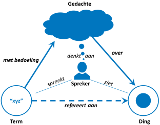

De derde hoek van de driehoek bestaat uit de gedachte die de spreker had over dit 'ding' op het moment dat hij hierover sprak. De spreker heeft het feitelijk niet over het echte 'ding', maar over zijn gedachte over dit 'ding'.

### Context: spreker en toehoorder

Een belangrijk aspect van de begripsdriehoek is het idee dat een term verwijst naar een ding zoals de spreker dit bedoelt. De toehoorder zal bij het horen van de mededeling van de spreker altijd zijn eigen gedachte bij de term hebben, en dus mogelijk een ander 'ding' of ander aspect van dit 'ding' voor ogen hebben.

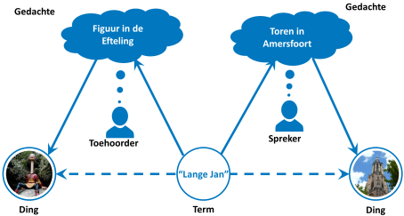

Bovenstaand figuur geeft een voorbeeld waar een dergelijke spraakverwarring is afgebeeld. De spreker gebruikt de term "Lange Jan" en heeft daarbij zijn eigen gedachte over een specifiek gebouw (de Onze Lieve Vrouwetoren in Amersfoort, Kadastraal middelpunt van Nederland en in de volksmond ook wel de "Lange Jan" genoemd). De toehoorder zit met zijn gedachten ergens anders (namelijk: in de Efteling), en verwacht dat de spreker het over iets heel anders heeft dan een gebouw.

Begrip ontstaat als er voldoende overlap is in de gedachten die sprekers en toehoorders hebben bij eenzelfde term. Dit idee is voor het eerst uitgewerkt door Peirce, en de consequenties voor de ICT verder door Sowa in "Ontology, Metadata and Semiotics" [ONTOMETA]. Context is daarbij cruciaal: verschillende contexten maken dat dezelfde termen naar andere begrippen verwijzen. Dit verschil in context wordt mooi geïllustreerd in het sesamstraat tekenfilmpje over 'grote dingen' [SS-TAAT].

Het vervelende aan natuurlijke taal is echter dat in geschreven taal aan de term niet zichtbaar is wie de spreker is. Bij gesproken taal is dit anders. Daar is duidelijk wie de woorden uitspreekt, dus ook wie 'bezitter' is van de gedachte. Zo kan een gesprek ontstaan, waarbij de toehoorder aan de 'bezitter' vragen stelt over de gedachte, om zo beter te begrijpen wat de spreker bedoelt. Zie bijvoorbeeld het sesamstraat filmpje 'Guess who I met today' [SS-GWIMT]

In 'Through the looking-glass' van Lewis Caroll wordt deze innige relatie tussen de betekenis van een term en zijn spreker verwoord in het gesprek tussen Alice en Humpty-Dumpty:

*"I don't know what you mean by 'glory'", Alice said.*

*Humpty Dumpty smiled contemptuously. "Of course you don't. Till I tell you. I meant 'there's a nice knock-down argument for you!'"*

*"But 'glory' doesn't mean 'a nice knock-down argument'," Alice objected.*

*"When I use a word," Humpty Dumpty said in rather a scornful tone. "It means just what I choose it to mean - neither more or less."*

*"The question is," said Alice, "whether you can make words mean so many different things."*

*"The question is," said Humpty Dumpty, "which is to be master - that's all."*

Hier stelt Humpty Dumpty dat hijzelf, en alleen hijzelf kan bepalen wat een woord betekent. Strikt genomen heeft hij gelijk. Maar als men betekenisvol wil communiceren en daarmee ook betekenisvol modelleren, dan is enige duidelijkheid nodig wat 'we' er mee bedoelen. Deze duidelijkheid kan worden bereikt door het definiëren van begrippen.</p>

Het belang van de interpretatie van woorden wordt bijvoorbeeld duidelijk in de rechtspraak. Een voorbeeld (waarbij bovendien de woorden van Lewis Caroll worden geciteerd) is de zaak Liversidge versus Anderson uit 1942 in Engeland [LIVAN]. Daar lag de vraag op tafel of de woorden van een wet in verschillende situaties anders uitgelegd mochten worden, ofwel: wie bepaalt in ultimo wat de betekenis is van de letter van de wet?

Een voorbeeld uit Nederland is het elektriciteitsarrest [EARREST], waarin een Haagse tandarts beschuldigd wordt van diefstal van elektriciteit door de meter te blokkeren met een breinaald. In cassatie verweert de tandarts zich met de stelling dat elektriciteit niet als 'enig goed' valt te kwalificeren, zodat niet aan de delictsomschrijving van artikel 310 uit het Wetboek van strafrecht (diefstal) is voldaan. Hij betwistte het begrip 'goed', of in elk geval de toepasselijkheid daarvan op iets immaterieels als elektriciteit.

Om de betekenis van symbolen te begrijpen, is het van belang om de afspraken te kennen waarmee de symbolen zijn gemaakt, of ten minste een verwijzing te hebben naar een ander symbool waar de afspraak wel van bekend is. Een voorbeeld van dit laatste is de Rosetta Stone [ROSETTA].

Het is dus nodig afspraken te maken over de manier waarop waarnemingen van dingen en gebeurtenissen in de werkelijkheid worden vertaald naar een representatie van deze dingen en gebeurtenissen in taal. Die representatie kan worden geïnterpreteerd, en weer worden terugvertaald naar de werkelijkheid zoals iemand zich die voorstelt. Op die manier kan iemand zich een beeld vormen van de werkelijkheid, ook al heeft hij die niet zelf waargenomen. Vanaf nu maken we onderscheid tussen de natuurlijke werkelijkheid en de administratieve werkelijkheid. De natuurlijke werkelijkheid is de 'echte', 'alledaagse', 'brute' werkelijkheid waarin we leven. De administratieve werkelijkheid is een representatie van de natuurlijke werkelijkheid in informatiesystemen.

Tegenwoordig wordt de meeste informatie vastgelegd in digitale informatiesystemen. Conceptueel verschilt dit niet wezenlijk van handgeschreven registraties. Nieuw is wel dat geautomatiseerde informatiesystemen hun informatie direct met elkaar kunnen uitwisselen zonder menselijke tussenkomst. Bij uitwisseling tussen handgeschreven informatiesystemen is er altijd iemand die het bronsysteem leest, de informatie begrijpt en vervolgens de informatie in het doelsysteem wijzigt. Afwijkingen tussen de modellen van de twee systemen worden daarbij door de persoon in kwestie 'vertaald' van het ene naar het andere model.

Tijdens automatische uitwisseling controleert niemand of de symbolen die in het bronsysteem zijn gebruikt wel hetzelfde betekenen als in het doelsysteem. Niemand kan bij een afwijking in betekenis ingrijpen om te zorgen dat de informatie 'correct' wordt ontvangen in het ontvangende systeem. 'Correct' wil hier zeggen dat het ontvangende systeem de symbolen naar dezelfde natuurlijke werkelijkheid terugvertaalt als dat het bronsysteem dat zou doen. Deze controle en eventuele vertaling moet dus in de koppelvlakken worden opgenomen zodat de automatische koppeling niet tot fouten leidt waardoor verkeerde conclusies worden getrokken.

### URI-term

We kunnen het model van de begripsdriehoek ook toepassen op een informatiesysteem. De term in de driehoek correspondeert dan met een identificatie in het informatiesysteem, de gedachte correspondeert met een onderdeel uit het conceptuele model van het systeem en het ding blijft, net als in natuurlijke taal, het 'echte' ding: het is geen onderdeel van het systeem.

De eerste twee principes van Linked Data, zoals genoemd in Hoofdstuk 1, geven een elegante manier om identificaties zo te kiezen dat problemen met synoniemen en homoniemen zo veel mogelijk worden voorkomen. Bovendien kunnen de identificaties verwijzen naar hun 'eigenaar', wat de mogelijkheid geeft om meer informatie te verzamelen en zo een beter begrip te krijgen.

**1. Use URIs as names for things.**

URI staat voor "Uniform Resource Identifier". Een URI is dus iets waarmee je op een eenduidige manier naar iets verwijst. Of eigenlijk nog preciezer: het is iets waarmee je een resource op een eenduidige manier identificeert, waardoor je er naar kunt verwijzen. De URI heeft hier de rol van 'term' uit de begripsdriehoek. De resource is hier het begrip dat het informatiesysteem (hier de spreker) heeft van het ding in de natuurlijke werkelijkheid.

**2. Use HTTP URIs so that people can look up those names.**

Http-URIs hebben de vorm van een URL (de L staat voor Locator) en dus kun je ze 'activeren'. Met een URL kun je informatie ophalen die op een server beschikbaar wordt gesteld. Een belangrijke bijkomstigheid is dat een http-URI duidelijk maakt van wie die informatie afkomstig is: van de eigenaar van het internetdomein van de URI. De URI verenigt zo de term en (gedachte)eigenaar in een identifier.

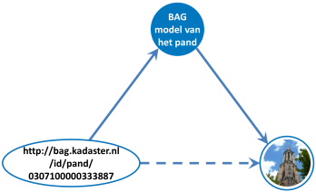

Merk op dat we in dit plaatje expliciet niet spreken over de 'BAG gedachte van de Lange Jan'. Informatiesystemen (zowel geautomatiseerd als handmatig) zijn deterministisch en hebben geen gedachten, zoals mensen deze hebben. Daarom spreken wij hier van het (conceptueel) model dat de BAG heeft van de Lange Jan. Dit wil overigens nog niet zeggen dat dit model altijd goed beschreven is! Een slecht gedocumenteerd informatiesysteem kan net zo ondoorgrondelijk zijn als de gedachten van een mens!

### Begrippen in deze sectie

| Begrip | Definitie |
|--------|-----------|
||Een **term** is een aaneenschakeling van één of meerdere woorden.|
||Een **ding** is iets in de natuurlijke werkelijkheid: een object, mens, machine, etc.|
||Een **naam** is een term die gebruikt wordt om te verwijzen naar een ding.|
||Een **actor** is een mens of IT systeem: iemand of iets dat een communicatieve handeling kan uitvoeren.|
||Een **gedachte** is het denkbeeld dat een mens heeft in een bepaalde context over een ding.
||Een **URI-term** is een term waarmee een resource op een eenduidige manier wordt geïdentificeerd.|
|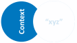|Een **context** is een begrip waarbinnen andere begrippen begrepen kunnen worden.|
||Een **begrip** is de overeengekomen betekenis van een term in een bepaalde context.|
|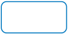|Een **model** is een vereenvoudigde representatie van een ding.|

## Vorm van communicatie

### Grammatica

Communicatie in natuurlijke taal vindt plaats volgens een model dat we de grammatica van een taal noemen. Eenvoudige uitspraken hebben de vorm [onderwerp] – [gezegde] – [lijdend voorwerp]. Bijvoorbeeld in de zin "Paul kent John" is "Paul" het onderwerp, "kent" het gezegde en "John" het lijdend voorwerp. Linked Data is gebaseerd op het uitgangspunt dat we ook met data dergelijke basale uitspraken kunnen doen. Hiervoor is RDF bedacht, het Resource Description Framework [RDF]. RDF is een standaard van het World Wide Web Consortium (W3C), oorspronkelijk ontworpen als een metadata-model, maar gaandeweg gebruikt als een formaat om gegevens in het algemeen voor te stellen en uit te wisselen. Uitspraken in RDF volgen een grammatica die erg veel lijkt op die van natuurlijke taal. Ze hebben de vorm van een triple: [subject] – [predicate] – [object].

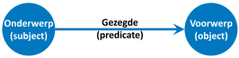

Met een triple wordt in feite een 'korte zin' uitgedrukt (zie ook 'Wat is een zin', Algemene Nederlandse Spraakkunst [ANS-ZIN]). De drie onderdelen van de triple, namelijk 'subject', 'predicate' en 'object' corresponderen met onderwerp, gezegde en (lijdend) voorwerp uit de natuurlijke taal. Een 'object' kan weer een 'subject' zijn in een volgende uitspraak, waardoor een netwerk van samenhangende dingen en uitspraken ontstaat. Grafisch wordt een triple vaak afgebeeld als een gerichte graaf: twee bolletjes (voorstelling van subject en object) die met elkaar verbonden zijn met een pijl die het predicate voorstelt. Als het object zelf niet gebruikt wordt om verder door te verwijzen (omdat het geen URI is, maar een vaste waarde, een literal [LITERAL]), dan wordt vaak in plaats van een bolletje een rechthoek gebruikt.

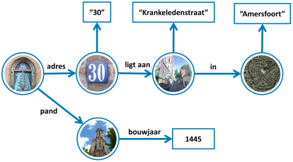

Bovenstaand voorbeeld toont plaatjes in plaats van URIs voor de (menselijke) leesbaarheid. Dit plaatje zou er als RDF met echte URIs als volgt uitzien. Voor de leesbaarheid zijn deze URIs met prefixen. Een prefix is een verkorte weergaven van een http domeinnaam.


Aangezien alleen ruimte is voor een onderwerp, gezegde en (lijdend) voorwerp, is er in de korte zin geen mogelijkheid om ook de context uit te drukken waarbinnen een mededeling als 'waar' moet worden beschouwd. Hiervoor biedt RDF de mogelijkheid van een 'named graph' (in goed Nederlands de "benoemde graaf"). Een set samenhangende triples vormt samen een 'named graph' die zelf ook weer een URI heeft, en de context van deze triples geeft. Via de URI van de 'graph' kan ook de herkomst van de mededeling worden vastgelegd: wie deed de mededeling, wanneer en vanuit welke gedachte?

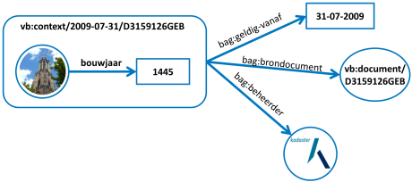

### Soorten zinnen naar communicatieve functie

Natuurlijke taal kent drie soorten zinnen naar communicatieve functie (bron: Algemene Nederlandse Spraakkunst [ANS]):

* *Mededelende zinnen*: een **uiting** van een bewering, dat wil zeggen: een mededeling;
* *Vragende zinnen*: een **verzoek** om een mededeling, dat wil zeggen: een vraag;
* *Bevelende zinnen*: een **opdracht** tot een actie, dat wil zeggen: een bevel.

De ANS spreekt nog van een vierde soort zin: de uitroepende zin. Dit is een zin die een emotie uitdrukt. Zo'n zin eindigt meestal op een uitroepteken. Daarbij wordt vermeld dat een dergelijke uitroepende zin in communicatieve functie weer een mededeling, vraag of bevel kan bevatten. Daarom beschouwen we de uitroepende zin hierna niet als een afzonderlijke soort zin.</p>

Voor vragende zinnen is het gebruikelijk om een vraagteken ("?") aan het einde van de zin te plaatsen. Voor mededelende zinnen is het gebruikelijk om een punt (".") aan het einde van de zin te plaatsen. Voor bevelende zinnen bestaat geen eenduidigheid. Verderop gebruiken we hiervoor een uitroepteken ("!").

Voorbeelden van deze drie soorten zinnen zijn:

* "Jan is geboren op 17 maart." (mededeling);
* "Kun je iets vertellen over Jan?" (vraag);
*	"Vergeet alles wat je over Jan kunt vertellen!" (bevel).

### HTTP (Hypertext Transfer Protocol)

Het World Wide Web, dat toegankelijk is via de browser en waar ook Linked Data op is gebaseerd, volgt het Hypertext Transfer Protocol (http). Dit protocol [HTTP] [PROTOCOLS] is vergelijkbaar met hoe een gesprek wordt gevoerd tussen twee mensen.

Een http-request komt overeen met:

* Een **vragende zin**, als sprake is van een verzoek om een mededeling, zonder dat een andere actie verwacht wordt. De meest gebruikte methode in het geval van een vragende zin is GET.
* Een **bevelende zin**, als sprake is van een opdracht tot actie (zoals: 'sla dit op'). De meest gebruikte methode in het geval van een bevelende zin is PUT, POST en DELETE. Het gebruik van GET voor een bevelende zin druist in tegen de principes van het http-protocol.

Een http-response komt overeen met:

* Een **mededelende zin**, als het antwoord op een vragende zin;
* Een **mededelende zin**, als het antwoord op een bevelende zin. In een dergelijk geval zegt de mededeling iets over de belofte of het resultaat van de verzochte actie).

In relatie tot de publicatie en het raadplegen van linked data gaat het om vragende en mededelende zinnen en de 'GET' http-request methode. Hiervoor geldt:

* Een **vragende zin** komt overeen met de URL die wordt ingetypt in de browser;
* Een **mededelende zin** komt overeen met de webpagina die vervolgens wordt getoond in de browser.

### De mededelende zin

Een eenvoudige, enkelvoudige mededelende zin heeft de vorm:
- Onderwerp (subject) - Gezegde (predikaat) - Voorwerp (object)

Deze vorm is identiek aan de opzet van een triple in Linked Data:

`<subject> <predicate> <object>`

Zo is de zin: "Jan kent Piet" gelijk aan de Linked Data representatie in Turtle-syntax [TURTLE]:

```
@prefix vb: <http://bp4mc2.org/voorbeeld/def#> .
@prefix vbpers: <http://bp4mc2.org/voorbeeld/id/Persoon/> .
vpers:Jan vb:kent vbpers:Piet .
```

In een triple wordt subject en predicate altijd afgebeeld op een URI. Een object mag zowel afgebeeld zijn op een URI als op een literal. Een literal is een stukje tekst, een datum, of een getal.

Dit betekent dat in een mededelende zin veel woorden (beter gezegd: termen) vervangen worden door identificerende elementen. Dit helpt om specifieke, formele uitspraken te doen: het wordt gemakkelijker om te begrijpen wat er wordt bedoeld, er is geen misverstand. Vaak wordt hier de term "disambiguation" gebruikt.

De volgende voorbeelden laten dit zien:

* Marco zei tegen Marco: "Heb je Marco al gesproken?"
* Marco Polo zei tegen Marco Janssen: "Heb je Marco Janssen al gesproken?"
* De persoon met BSN 1234 zei tegen de persoon met BSN 4321: "Heb je de persoon met BSN 8743 al gesproken?"

De eerste zin kent de minst specifieke aanduiding voor de drie personen die in de zin voorkomen. Dit maakt de zin ambigu en dus lastig te begrijpen. Immers: over welke Marco hebben we het? In de tweede zin worden de personen al iets specifieker aangeduid. Deze zin klinkt een stuk formeler, en leest minder prettig, maar is wel beter te begrijpen. De derde zin kent een zeer specifieke aanduiding. De derde zin is volstrekt duidelijk en ondubbelzinnig, maar nogal omslachtig geformuleerd.

### De URI (Uniform Resource Identifier)

In een RDF triple worden het onderwerp, gezegde en soms ook het (lijdend) voorwerp geïdentificeerd door middel van URIs. Een URI kan verschillende vormen hebben. Zie hiervoor de URI specificaties [RFC3986], of de meer leesbare wikipedia beschrijving [URI].

Voorbeelden van correcte URI-namen van 'Marco', 'Marco Polo' en 'BSN 1234' zijn:

1. `urn:term:Marco`
2. `http://bp4mc2.org/voorbeeld/id/persoon/Marco`
3. `urn:uuid:1234`
4. `http://bp4mc2.org/voorbeeld/id/persoon/1234`

De oneven URIs zijn URNs. Dit zijn gewoon namen, zonder dat hiermee ook een (internet) locatie wordt gegeven (URN = Uniform Resource Name). De even URI-namen zijn URLs (URL = Uniform Resource Location), dat wil zeggen namen die gelijktijdig ook een (internet) locatie aanduiden.</p>

Aangezien een internetlocatie overeen komt met de URL die wordt ingetypt in de browser, is een URL hiermee niet alleen een naam, maar gelijktijdig ook een vragende zin!

* Een **URL** vertegenwoordigt zowel een naam (identificatie) als een vraag;
* Een **URN** vertegenwoordigt slechts een naam (identificatie).

### De URL (Uniform Resource Location) als vraag

Een URL kan zowel een vraag als de naam van 'iets' zijn. Het is duidelijk wat wordt bedoeld met de URL als naam voor 'iets', namelijk precies dit 'iets':

- De url `http://bp4mc2.org/voorbeeld/id/persoon/1234` is hier de naam (of identificatie) van een persoon met de volledige naam "Marco Polo", voornaam "Marco" en BSN "1234".

Ook is duidelijk dat een URL nooit een mededelende zin kan zijn. Zo'n zin is immers geen triple. Hij bevat wel een onderwerp, maar geen gezegde of lijdend voorwerp. In onderstaand voorbeeld is de eerste zin geen linked data zin, de tweede wel.</p>

- `<http://bp4mc2.org/voorbeeld/id/persoon/1234>.`
- `<http://bp4mc2.org/voorbeeld/id/persoon/1234> <http://bp4mc2.org/voorbeeld/def#sprak-met> <http://bp4mc2.org/voorbeeld/id/persoon/8743>.`

In de wereld van Linked Data kan een URL ook worden gebruikt als vraag. Het derde Linked Data principe stelt: "When someone looks up a URI, provide useful information" [LINKED-DATA])

In het voorbeeld kan dit het volgende gesprek opleveren:

- Vraag: 'De persoon met BSN “1234”?'
- Antwoord: 'De persoon met BSN "1234" heet "Marco Polo", we noemen hem vaak "Marco", zijn BSN is "1234" en hij sprak met de persoon met BSN "8743"'.

Of in Linked Data (Turtle syntax):


### Overige URL vragen

In de voorgaande sectie hebben we de URL besproken die zowel een 'Naam' was als een 'Vraag'. Er zijn echter veel meer vragen denkbaar, en ook veel meer URLs.

Zo willen we onderscheid maken tussen de URL-Naam en de URL-Vraag. Elke URL-Vraag is een URL die geen URL-Naam is.

Om in de vormgeving een URL-Naam te kunnen onderscheiden van een URL-Vraag stellen we voor om in de URL een vraagteken op te nemen, gevolgd door aanvullende informatie met betrekking tot de vraag, dus bijvoorbeeld:


Deze URL-Vraag komt overeen met de zin in natuurlijk taal:

- 'Kun je iets vertellen over personen met voornaam "Marco"?'

### Begrippen in deze sectie

| Begrip | Definitie |
|--------|-----------|
||Een **triple** is een combinatie van 'onderwerp', 'gezegde' en '(lijdend) voorwerp': [subject, predicate, object].|
|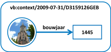|Een **graph** is een verzameling van triples.|

## Betekenis van communicatie

### Feiten in de natuurlijke en institutionele werkelijkheid

Volgens wikipedia is een feit "een gebeurtenis of omstandigheid waarvan de werkelijkheid vaststaat, ofwel zintuiglijk kan worden waargenomen of instrumenteel gemeten". [FEIT] Het tijdsaspect is van belang bij het beschouwen van een feit: de werkelijkheid van een omstandigheid kan vaststaan op één moment in tijd, maar op een ander moment in tijd juist zijn verdwenen.

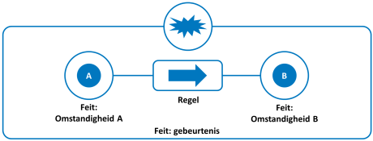

Gebeurtenissen zijn juist nooit op een stilstaand moment te aanschouwen. Een gebeurtenis stelt feitelijk voor dat de ene omstandigheid verandert in een andere omstandigheid. Wil een gebeurtenis een feit zijn, dan moet de werkelijkheid van beide omstandigheden vaststaan, maar bovendien moet vaststaan dat er een 'regel' is die feitelijk (dus waarvan de werkelijkheid ook vaststaat) bepaalt dat omstandigheid A wetmatig resulteert in omstandigheid B. Zie voor een uitleg van wat een regel is: defining business rules – what are they really [RULES]. In de natuurlijke werkelijkheid zijn deze regels de natuurwetten. Zo valt een appel van een boom als de zwaartekracht die op deze appel wordt uitgeoefend groter is dan de sterkte van de verbinding tussen de appel en de tak waaraan hij hangt.

De Wikipedia-definitie van 'feit' kent een open eind: Wat staat als werkelijkheid vast? Van enkele zaken zal iedereen veronderstellen dat deze ‘vaststaan’. Weinig mensen zullen ontkennen dat de brug waarmee zij een rivier oversteken 'bestaat'. Zonder de brug zou je immers vallen (een natuurwet). Andere aspecten die wij mensen als de 'vaststaande werkelijkheid' beschouwen zijn echter niet natuurlijk en hebben te maken met sociale afspraken: Dat er zoiets bestaat als de 'soevereine en democratische rechtsstaat Nederland' is een afspraak waar de meeste mensen zich aan houden, dus daarmee is dat (op dit moment) een feit. Maar in 1500 was de 'soevereine en democratische rechtsstaat Nederland' nog geen feit.

Dit laatstgenoemde feit is een voorbeeld van een institutioneel feit. Een institutioneel feit is een feit waarvan de werkelijkheid zijn grondslag heeft in sociale instituties. Hiertoe rekenen we de overheid die de wet schrijft, deze uitvoert en die recht spreekt, maar ook standaardisatie-organisaties die afspraken die mensen maken formeel vastleggen.

Het geheel van deze sociale instituties en de institutionele feiten die zij vastgesteld hebben noemen we de institutionele werkelijkheid.

### Relatie tussen natuurlijke en institutionele werkelijkheid

Alles wat de overheid doet, is gebaseerd op een wettelijke grondslag. Dit is het zogenoemde legaliteitsbeginsel. De wet en daarop gebaseerde (gedelegeerde) regelingen omschrijven de begrippen die relevant zijn binnen het toepassingsgebied van die wet. Ook bepaalt de wet wat in welke gevallen mag, niet mag of moet met de dingen die met die begrippen worden aangeduid, en onder welke voorwaarden.

Om begrip van wetgeving te krijgen, is het van belang inzicht te hebben in de gelaagdheid van wetgeving en van de relaties en afhankelijkheden tussen regelingen. Deze aspecten kunnen de betekenis van een wettelijk begrip beïnvloeden.

Het recht kent hiervoor de volgende vier principes:

* *Lex specialis derogat legi generali* - specifieke bepalingen gaan voor algemene bepalingen.
* *Lex superior derogat legi inferiori* - hogere wetgeving geeft kaders voor lagere wetgeving.
* *Lex posterior derogat legi priori/anteriori* - jongere wetgeving gaat voor oudere wetgeving.
* *Jurisprudentie* – rechtsvormende uitspraken. In het bijzonder uitspraken van rechters in concrete rechtszaken. Jurisprudentie kan invulling geven aan de betekenis van wetgeving.

Volgens de paradigma's in de rechtsinformatica (zie [RECHTPARA]) is de wet opgebouwd uit:

* Begrippen die dingen in de (natuurlijke) werkelijkheid aanduiden waar de betreffende wet betrekking op heeft.
* Gebeurtenissen of handelingen die met betrekking tot de dingen die met deze begrippen worden aangeduid kunnen plaatsvinden.
* De voorwaarden waaronder rechtshandelingen mogen worden uitgevoerd en die de rechtsgevolgen ervan bepalen.


Het bovenstaande figuur laat de dynamiek zien waarlangs rechtsgevolgen ontstaan door gebeurtenissen in de natuurlijke werkelijkheid.

Een institutioneel feit heeft altijd een daaraan voorafgaande aanleiding in de natuurlijke werkelijkheid. Voorbeelden zijn een geboorte die aanleiding is voor het opstellen van een geboorteakte, de oprichting van een organisatie die aanleiding is voor het opstellen van een oprichtingsakte en de verkoop van een huis die aanleiding is voor het opstellen van een akte van eigendomsoverdracht.

Zo'n feit heeft altijd een rechtsgevolg, dat wil zeggen het leidt tot een rechtsfeit. Na de verwerking van een geboorteakte in het bevolkingsarchief bestaat een kind juridisch, na de verwerking van een oprichtingsakte door de Kamer van Koophandel kan een organisatie rechtshandelingen uitvoeren en na de verwerking van de overdrachtsakte door het Kadaster is iemand pas formeel eigenaar van het huis.

Aanleiding, voorwaarde en eindsituatie kunnen worden beschreven in de vorm van regels. De aanleiding geeft aan 'wanneer' de gebeurtenis optreedt (wat de 'trigger' is), de voorwaarde geeft aan of de gebeurtenis ook mag optreden. De eindsituatie is de situatie die geldt na afloop van de gebeurtenis.

### Administratieve werkelijkheid

De institutionele (en daarmee ook de juridische) werkelijkheid is niet waar te nemen. Het is als een mondelinge afspraak: achteraf kun je alleen nog via menselijke en 'stille' getuigen (akten e.d.) achterhalen wat de institutionele feiten zouden moeten zijn.

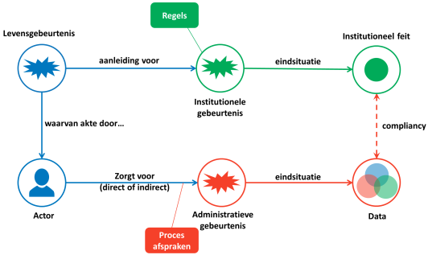

Registreren van juridische feiten in een administratie is dan ook noodzakelijk voor een goede verstandhouding tussen mensen, en in het bijzonder: voor een goede rechtsorde. Het figuur op de vorige pagina laat zien hoe dit proces in zijn werk gaat:

* Een bepaalde levensgebeurtenis heeft, volgens de institutionele afspraken, rechtsgevolgen.
* Om deze rechtsgevolgen te kunnen registreren, zal een actor (die daartoe in deze specifieke situatie bevoegd is, zoals bijvoorbeeld een notaris) de levensgebeurtenis registreren ("waarvan akte").
* De actor zorgt (direct of indirect) voor het opvoeren van de gegevens met betrekking tot de levensgebeurtenis. Dit opvoeren is feitelijk ook weer een gebeurtenis, nu in de administratie.

Er is sprake van compliancy als de procesafspraken leiden tot geregistreerde gegevens die een correcte weergave zijn van de rechtsfeiten.

### Begrippen in deze sectie

| Begrip | Definitie |
|--------|-----------|
||Een feit is een gebeurtenis of omstandigheid waarvan de werkelijkheid vaststaat.|
||Een natuurlijk feit is een feit dat werkelijkheid is in de natuurlijke werkelijkheid.|
||Een gegeven is een administratief feit dat als zodanig is geregistreerd in een informatiesysteem.|
||Een institutioneel feit is een feit dat werkelijkheid is conform een stelsel van afspraken (die zijn opgesteld door een instituut).|
||Een regel beschrijft hoe feitelijke situaties zich ten opzichte van elkaar verhouden|
||Een levensgebeurtenis is een gebeurtenis in de natuurlijke <br> werkelijkheid, in 'het leven van een mens'.|
||Een administratieve gebeurtenis is een gebeurtenis in een IT-systeem (zoals het toevoegen van data).|
||Een institutionele gebeurtenis is een gebeurtenis die plaatsvindt in de institutionele werkelijkheid.|
||De werkelijkheid is datgene dat iemand voor waar aanneemt.|
||De natuurlijke werkelijkheid is de werkelijkheid waarin wij leven, waarin natuurwetten gelden.|
||Een administratieve werkelijkheid is een representatie van de natuurlijke werkelijkheid in een informatie systeem.|
|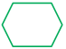|Een institutionele werkelijkheid is een werkelijkheid volgens algemeen aanvaarde afspraken.|
||Een juridische werkelijkheid is een institutionele werkelijkheid waarin de wet- en regelgeving geldt.|

## Gebruik

We kunnen natuurlijk proberen een deel van de natuurlijke werkelijkheid zelf vast te leggen om deze veilig te stellen, zodat die werkelijkheid op een later tijdstip, door onszelf of door anderen, opnieuw opgeroepen of gereconstrueerd kan worden. Dit doen we bijvoorbeeld bij het verzamelen van vlinders of postzegels, of bewijsstukken in een rechtszaak. De veilig gestelde objecten kunnen, mits goed bewaard, later aantonen hoe de werkelijkheid was op het moment van vastleggen. Maar er gaat altijd informatie verloren. De vlinder wordt gedood en opgeprikt, de postzegel wordt van een envelop gehaald en wie garandeert dat het pistool na de moord niet door een ander is aangeraakt?

Het lukt dus nooit om de hele context van een natuurlijke situatie, zoals die op dat moment en op die plaats geldt, te vangen. Het is in veel gevallen praktischer om een representatie van de relevante aspecten van de werkelijkheid vast te leggen. Dit kan in een realistische representatie zoals een afbeelding, een foto, een film of een geluidsopname. Maar meestal wordt informatie vastgelegd in symbolen of in tekst. Meer abstracte begrippen zoals prijs, gewicht en productiedatum kunnen alleen maar op die manier worden vastgelegd.

### Begrippen

In de voorgaande paragraaf hebben we het over concrete zaken gehad: een geboorte, een gebouw, een registratie van gegevens. Om de betekenis van deze zaken te kunnen beschrijven, is het noodzakelijk om een abstractie te introduceren: de abstractie van 'begrippen'.


Een 'begrip' is de abstractie van een 'ding' in de natuurlijke werkelijkheid. Een begrip wordt aangeduid met minimaal één voorkeurs-term. Ook hier kunnen we de begripsdriehoek gebruiken. Alleen gaat het in dit geval niet om een gedachte, maar om een afspraak over wat het begrip zou moeten betekenen. Het onderstaande figuur geeft de driehoek weer voor het begrip "Pand" uit de BAG.


Het 'ding' aan de rechterkant is in dit geval geen concreet 'ding', maar een abstractie: een 'pand' zoals bedoeld in de BAG. Het wolkje bovenin betreft de afspraak over de betekenis van een 'Pand'.

### Formalisering in een axiomatisch begrippenstelsel

Een begrip is te identificeren door een term te verbinden met een context. Hiermee is duidelijk wanneer twee begrippen dezelfde betekenis hebben (term+context is gelijk), of wanneer twee begrippen van elkaar verschillen (term+context is anders).


Dit geeft nog geen duiding aan de betekenis van het begrip. Daarvoor is het noodzakelijk om begrippen met elkaar te verbinden op een manier waardoor de betekenis verder wordt geduid. Hiervoor biedt het vakgebied van de semantiek aanknopingspunten. In dit vakgebied is het gebruikelijk om 'description logic' toe te passen voor het beschrijven van de betekenis van begrippen. Het idee hierachter is dat betekenis uitgedrukt kan worden in classificaties. Elk begrip is dan een classificatie van concrete voorkomens. De verzameling van alle potentiële voorkomens waarvan gezegd kan worden: "Dit is er zo 1", wordt de extensie van een dergelijke classificatie genoemd. Twee begrippen hebben vervolgens dezelfde betekenis is als de bijbehorende extensies precies dezelfde elementen bevatten.


Een begrippenmodel kan qua diepgang beperkt zijn of juist heel diep gaan:

* Het model kan zich beperken tot een opsomming van termen met een uitleg, zonder enig verband tussen de termen. Dit leidt tot een woordenlijst.
* Een taxonomie is een model van begrippen, waarin wordt aangegeven welke begrippen een ruimere betekenis hebben dan een ander begrip.
* Een thesaurus gaat een stapje verder. Naast hiërarchische relaties tussen begrippen kent een thesaurus ook andere relaties zoals 'heeft relatie met'.
* Aanvullend op de thesaurus zijn ook deel-geheel relaties denkbaar.
* Een volledige description logic kent alle rijkdom van eerste orde predicatenlogica.

Voor het rechtlijnig kunnen redeneren op basis van een begrippenstelsel is een begrippenmodel nodig dat een stapje verder gaat dan een thesaurus. Het doel is niet zoals bij taxonomieën en thesauri om woorden ten opzichte van elkaar te ordenen, maar om een begrippenstelsel te definiëren waarmee je kunt redeneren over begrippen. Hiervoor is het axiomatisch begrippenstelsel bedoeld. Dit stelsel heeft de volgende eigenschappen:

* Begrippen worden gedefinieerd in termen van andere begrippen.
* Elke (betekenisvolle) relatie tussen twee begrippen heeft een richting: van het begrip (A) dat voor zijn betekenis afhankelijk is van het begrip (B).
* Een begrip is voor zijn betekenis afhankelijk van een ander begrip, als dit begrip wordt gebruikt in de definitie.
* Als begrip (A) afhankelijk is van begrip (B), dan betekent dit ook dat begrip (A) pas te begrijpen is, als begrip (B) wordt begrepen.
* Alle betekenisvolle relaties zijn asymmetrisch. Dat betekent dat als A->B, dan mag niet gelden: B->A.
* Alle betekenisvolle relaties zijn transitief. Dat betekent dat als A->B en B->C, dan geldt ook A->B->C.
* Er mogen geen circulaire relaties ontstaan. Dat betekent dat niet mag gelden: A->B->C->A.
* Het axiomatisch begrippenstelsel kent uiteindelijk 'axioma's': begrippen die niet verder worden gedefinieerd in termen van andere begrippen. Er wordt verondersteld dat de beoogde toehoorder deze begrippen al begrijpt.

Optimaal is als de axioma's begrippen zijn die als 'eenvoudig' worden gekenmerkt, zie hiervoor: woordenlijst taalniveau B1 [EENVWOORD].

### Natuurlijke werkelijkheid versus data

Met een axiomatisch begrippenstelsel kan de institutionele werkelijkheid min of meer geformaliseerd worden beschreven. Dit is echter nog geen model in de zin van een volledig uitgewerkte ontologie waarin data over de dingen in de natuurlijke werkelijkheid die met deze begrippen worden aangeduid kunnen worden gerepresenteerd. De Wet Basisregistraties Adressen en Gebouwen (BAG) geeft definities voor de begrippen 'openbare ruimte', 'nummeraanduiding' en 'woonplaats'. Deze definities kunnen worden gerepresenteerd in een samenhangend axiomatisch begrippenstelsel. Dat geeft inzicht, maar is nog niet voldoende voor het ontwerpen van een informatiesysteem waarin data over de 'dingen' die met de termen "openbare ruimte", "nummeraanduiding" en "woonplaats" worden aangeduid, kunnen worden opslagen.

Zo kan in de BAG bij een ‘nummeraanduiding’ worden gedefinieerd dat deze 'is gerelateerd aan' een 'openbare ruimte' en dat een 'openbare ruimte' is 'gerelateerd aan' een 'woonplaats'. Voor een ontologie is veel meer nuance nodig. Bijvoorbeeld 'in 1 openbare ruimte mag een nummeraanduiding maar 1 keer voorkomen'.

Wat daarbij soms uit het oog wordt verloren, is het feit dat het om een registratie gaat, dus om de administratieve werkelijkheid, en niet om de 'echte', natuurlijke werkelijkheid. Een registratie bevat alleen maar data die iets veronderstellen over de natuurlijke werkelijkheid. Het bevat niet de natuurlijke werkelijkheid zelf: een klantenregistratie bevat geen 'klanten', maar 'data over klanten'. En zelfs een registratie van artikelprijzen bevat geen 'artikelprijzen', maar slechts 'data over artikelprijzen'.

Als het onderscheid tussen natuurlijke en administratieve werkelijkheid uit het oog wordt verloren, kan dat leiden tot Kafkaëske-toestanden: 'Ik bel u, omdat ik een aanmaning heb ontvangen dat ik mijn telefoonabonnement niet zou hebben betaald, maar ik ben helemaal geen klant van u'. Reactie: 'Dat klopt, u staat niet in ons computersysteem. U hoeft niet te betalen'. Vervolg: 'Maar er staat nu wel een deurwaarder mijn huis leeg te halen!!'. Reactie: 'Dat kan niet, u bent geen klant volgens ons computersysteem'. Hier wordt de natuurlijke werkelijkheid ontkend, en de administratieve werkelijkheid als de ware verondersteld. (meer voorbeelden op bijvoorbeeld "Computer says no" [COMPSAYSNO]).

Als sketch in een humoristisch programma zal iedereen dit herkennen en er om lachen, maar er zijn ook schrijnende gevallen waarbij mensen hun uitkering of toeslagen verliezen omdat de administratieve werkelijkheid voor de waarheid wordt gehouden. Aan de andere kant wordt ook misbruik gemaakt van de soms gebrekkige koppeling tussen data in administratieve werkelijkheden, bijvoorbeeld bij B.V. fraudes.

### Context van data

Een informatiesysteem bevat data. Wij gebruiken in dit document het begrip 'data' als synoniem voor 'gegevens'. Data zijn de vastgelegde uitdrukking van 1 of meerdere feiten (zie ook [GEGEVEN]). Die feiten kunnen afkomstig zijn uit verschillende werkelijkheden:

Het kunnen feiten uit de natuurlijke werkelijkheid zijn die zijn waargenomen door een sensor of een persoon. Deze heeft de relevante aspecten van die waarneming ingevoerd in het informatiesysteem dat deze aspecten vervolgens als data heeft vastgelegd.

Het kunnen feiten uit een (andere) administratieve werkelijkheid zijn waarover de data via een automatisch koppeling het informatiesysteem binnenkomen.

Het kunnen feiten uit een institutionele werkelijkheid zijn, ingevoerd door mensen en bepaald op basis van (reken)regels.

Data vormen een discrete representatie van het waargenomen continuüm. Het betreft een waarneming van de voortdurend veranderende werkelijkheid, die op enig moment volgens een bepaald model (dat wil zeggen: een vereenvoudiging van de werkelijkheid die past bij de gewenste context) wordt vastgelegd.

Het is onmogelijk om een situatie in de natuurlijke werkelijkheid in zijn geheel vast te leggen. We leggen enkel vast wat we vooraf relevant achten voor kwesties waarvan we vermoeden dat die zich in een bepaalde context voor kunnen doen. Wat achteraf als relevant wordt beschouwd kon vooraf vaak niet voorzien of waargenomen worden. Iedere natuurlijke situatie of gebeurtenis kent een oneindig aantal eigenschappen, die niet allemaal waargenomen en vastgelegd kunnen worden.

Twee waarnemingen van dezelfde werkelijkheid maar op verschillende momenten, of op hetzelfde moment maar volgens verschillende modellen, kunnen dus leiden tot verschillende data. Het model specificeert welke aspecten van de werkelijkheid worden vastgelegd en bepaalt daarmee de context waarin de data gebruikt kunnen worden.

Vrijwel elke moderne modelleerwijze maakt onderscheid tussen representaties van dingen en representaties van relaties tussen die dingen. Dingen zijn concreet en tastbaar (een persoon, een gebouw, een voertuig), of abstract (een organisatie, een typering, een kleur). Met relaties worden dingen met elkaar verbonden.

Elke specificatie gaat uit van reeds aanwezige kennis bij degene die de specificatie leest en toepast. Hoe uitgebreider en nauwkeuriger de specificatie, hoe beter gebruikers begrijpen hoe zij hun waarnemingen moeten vertalen naar data. Andersom helpt dit gebruikers om data te interpreteren, dat wil zeggen terug te vertalen naar de werkelijkheid die door de data wordt gerepresenteerd.

Een basisregistratie (bijvoorbeeld de kadastrale registratie) bevat een administratieve werkelijkheid die een afspiegeling is van de natuurlijke werkelijkheid, maar slechts voor zover die is vastgelegd in de institutionele werkelijkheid. We illustreren dit aan de hand van het voorbeeld 'het kopen van een huis'.

Het kopen van een huis is typisch een 'levensgebeurtenis' in de natuurlijke werkelijkheid.

Daarvoor worden juridisch meerdere dingen vastgelegd, zoals de aflossing van de hypotheek door de vorige eigenaar, het vestigen van een nieuwe hypotheek en de overdracht. Dit zijn verschillende institutionele feiten die stuk voor stuk als zodanig in akten worden vastgelegd door een notaris.

Deze institutionele feiten leiden tot een bijwerking van de Kadastrale registratie. Zo bekeken is een basisregistratiehouder eigenlijk een tweedelijns organisatie. De betrokkenen in de natuurlijke werkelijkheid gaan naar een loket om hun zaken institutioneel te regelen. Bij een vastgoedtransactie is dit een notaris die de transactie als institutionele gebeurtenis vastlegt in een akte ('waarvan akte'), bij een geboorte is dit een ambtenaar van de burgerlijke stand die een geboorteakte opstelt.

De notaris schrijft deze akte in en de basisregistratie verwerkt de in de akte opgetekende gegevens over de institutionele feiten in de registratie. Daarbij hanteert de houder een basispatroon dat bij iedere basisregistratie wordt gebruikt:

* Een basisregistratie wordt altijd bijgewerkt op basis van een brondocument met een institutionele status. Bij het Kadaster zijn dat meestal notariële akten, maar het kan ook een beschikking van een publiekrechtelijke organisatie zijn. Voorbeelden van akten uit andere basisregistraties zijn een oprichtingsakte van een bedrijf of een geboorteakte van een persoon. Voorbeeld van een beschikking vind je in de Basis Registratie Inkomen (BRI): het authentieke inkomensgegevens wordt (onder andere) bepaald op basis van de opgelegde aanslag Inkomstenbelasting.
* In dit brondocument zijn één of meer institutionele feiten opgetekend.
* Er is altijd een aanleiding in de natuurlijke werkelijkheid om een specifiek brondocument met de betreffende institutionele feiten op te stellen.
* De institutionele feiten worden verwerkt in de registratie. Daarbij is sprake van een was-situatie (vóór de verwerking van het feit) en een wordt-situatie (ná de verwerking van het feit). De laatste geeft de nieuwe actuele institutionele situatie aan.
* Wijzigingen in de registratie zijn al dan niet relevant voor ketenpartners die informatie afnemen. Zo zal een gemeente voor wat betreft de basisregistratie Kadaster geïnteresseerd zijn in 'overdracht van eigendom' om de WOZ aanslag naar het goede adres te kunnen sturen, maar niet in 'inschrijving hypotheek'.

Een ander voorbeeld van een situatie waarin duidelijk is dat de data niet de natuurlijke werkelijkheid zijn is een kadastrale grens die in een kaart is getekend. Als een lijn op de kaart wordt vergroot naar ware grootte kan deze wel een meter breed worden. De meeste conflicten over een erfgrens gaan over minder. Bij zo’n conflict, dat regelmatig is te zien in het Nederlandse televisieprogramma 'De rijdende rechter', gaat een rechter in de regel samen met een landmeter naar de betreffende locatie zodat hij kan beoordelen hoe de natuurlijke werkelijkheid is. De rechter baseert zijn uitspraak op zijn beeld van deze werkelijkheid.

Om data te kunnen beoordelen is altijd informatie nodig over hoe, waar en wanneer deze zijn ingewonnen. Voor het verkrijgen van huurtoeslag is het niet voldoende ergens te wonen waar je recht hebt op die toeslag. De verhuizing moet op tijd (niet na bijvoorbeeld een aantal jaren) worden gemeld aan de houder van de Basis Registratie Personen (BRP) op basis waarvan die toeslag wordt toegekend. De administratieve werkelijkheid moet kloppen met de natuurlijke werkelijkheid om het institutionele feit te creëren (of zelfs: we maken de administratieve werkelijkheid leidend bij het creëren van het institutionele feit).

### Correcties

Een bijzonder patroon vormen correcties in de administratieve werkelijkheid. Ten opzichte van het basispatroon zijn er vooral enkele nuanceverschillen:

* Het brondocument is een intern stuk dat is opgesteld door iemand die daartoe bevoegd is.
* De aanleiding zit niet in de natuurlijke werkelijkheid en ook niet in de institutionele werkelijkheid. Aanleiding is de constatering dat de administratie niet in overeenstemming is met de natuurlijke of institutionele situatie.
* In het administratieve werkelijkheid is nog steeds sprake van een was-wordt transformatie.
* Deze wijziging is wel degelijk relevant voor afnemers die hun processen baseren op de informatie uit die administratieve werkelijkheid. Daarmee is het ook relevant om niet alleen vast te leggen dat het een correctie betreft, maar ook welke informatie is gecorrigeerd. Dit kan er bijvoorbeeld toe leiden dat een aanvankelijk geweigerde toeslag alsnog wordt toegekend.
