# Modelleerwijze

In dit hoofdstuk beschrijven we:

* Een URI strategie in de vorm van een model dat de symboliek en de vorm van communicatie via het web over dingen in de natuurlijke werkelijkheid ondersteunt.
* Een model dat de betekenis van communicatie in de institutionele werkelijkheid ondersteunt. In dit model wordt de institutionele werkelijkheid vertaald naar een axiomatisch begrippenstelsel.
* Een model dat het gebruik van communicatie in de administratieve werkelijkheid ondersteunt. In dit model wordt de institutionele werkelijkheid zoals beschreven in een axiomatisch begrippenstelsel vertaald naar een datamodel.

## De URI-strategie

Deze paragraaf beschrijft een voorstel voor een Nederlandse URI-strategie. De tekst is voor het grootste deel ontleend aan "Aanzet tot een nationale URI-Strategie voor Linked Data van de Nederlandse overheid" dat in het vorig jaar van de PiLOD is geschreven. [[URISTRAT]]. De URI-strategie beschrijft een aantal principes voor het opstellen van een patroon (syntax) van de URIs waarmee je de data in je informatiesysteem als betrouwbare en toegankelijke linked data kunt publiceren op het web.

### Scope
De URI-strategie richt zich met name op data waarmee objecten of concepten worden gedefinieerd, waar andere toepassingen naar kunnen verwijzen. Data waar niet naar wordt gelinkt valt buiten de scope. Om dit toe te lichten onderscheiden we drie categorieën informatiesystemen:

* Online specificaties van Standaarden
* Authentieke registraties
* 'gewone' Applicaties

Elk met de nadruk op een van de volgende drie categorieën 'data':

1. Referentiemodellen
2. Referentieobjecten
3. 'gewone' Data

De belangrijkste functie van een Standaard is gewoonlijk om een conceptueel model te definiëren. Authentieke registraties worden doorgaans opgezet om een administratie van Referentieobjecten bij te houden en onder een 'gewone' Applicatie verstaan we een informatiesysteem dat slechts Data verzamelt voor één specifiek doel.

In alle drie de categorieën van informatiesystemen komen alle drie de categorieën data voor, maar niet in gelijke mate.

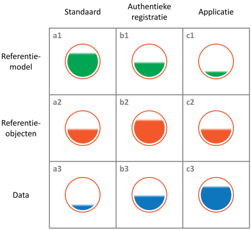

De grootte van een cel in het diagram geeft een indicatie van het gewicht van de betreffende categorie concepten in die categorie van informatiesystemen.

Op de diagonaal van linksboven naar rechtsonder staan de belangrijkste categorieën data per categorie systeem (a1, b2, c3).

Uiteraard kunnen een Authentieke registratie en een Applicatie een eigen Model hebben (b1 en c1), sommige Standaarden verstrekken een lijst met Referentiewaarden (a2) en Applicaties kunnen lokale Referentiegegevens hebben (c2). Ook kunnen Standaarden en Registers wat 'gewone' data nodig hebben (a3 en b3), bijvoorbeeld om wijzigingen en herkomst van hun referentiegegevens vast te leggen.

De URI-strategie ondersteunt het hergebruik van Concepten en Referentieobjecten door andere data-collecties. De interessante categorieën zijn dan ook de termen in de Modellen en de Referentiegegevens.

| Categorie | Omschrijving |
|-----------|--------------|
|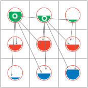|Termen, zoals klassen en eigenschappen, die zijn gedefinieerd in de Modellen van een Standaard of een Authentieke registratie, worden gebruikt om Referentieobjecten en Data te classificeren.|
|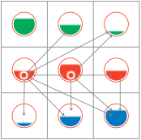|Referentieobjecten, gedefinieerd door Standaarden (denk aan waardenlijsten), maar vooral die beheerd worden in Authentieke registraties, worden gebruikt in 'gewone' Applicaties.|
|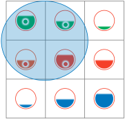|De URI-strategie is bedoeld voor Modellen en Referentieobjecten van zowel Standaarden als Authentieke registraties. Dus niet in eerste instantie voor de 'gewone' Data (rij 3) of concepten in 'gewone' Applicaties (kolom c) aangezien daar nou eenmaal niet of nauwelijks naar wordt gelinkt.|

### URI-strategie best-practices

Gedurende de PiLOD heeft de Werkgroep URI-strategie een aantal inzichten opgedaan bij de analyse van de voorgestelde varianten.

**No register, no identifier**

In Linked Data theorie wordt nogal eens beweerd dat het nodig is om voor elk concept of object een URI te definiëren, waardoor het lijkt alsof je pas kunt beginnen als je voor elk concept of object een nieuwe Linked Data URI hebt verzonnen en 'gemunt' (to mint a URI). Maar waarom zou je alles opnieuw definiëren? De mensheid definieert al eeuwen lang authentieke identificatie voor standaard begrippen en referentieobjecten. Denk aan encyclopedieën, taxonomieën en registraties van inwoners of van onroerende goederen. We noemen hier een voorziening voor het authentiek definiëren en identificeren van concepten of referentieobjecten een register. Onder register verstaan we hier dus zowel een specificatie van begrippen/concepten in een standaard, als een authentieke registratie van referentieobjecten. (De oplettende lezer merkt op dat ook een authentieke registratie van alle wet- en regelgeving onder deze definitie van een register valt.)

Doel van deze niet geringe inspanning om registers op te zetten is, om vanuit verschillende administraties op een eenduidige manier met afgesproken termen (een identifier) naar nauwkeurige en meer uitgebreide definities van abstracte begrippen en objecten te kunnen verwijzen zodat iedereen weet wat bedoeld wordt. Door het gebruik in informatiesystemen van dezelfde standaard termen voor de concepten in een model en de identifiers van referentieobjecten uit een register kunnen we op efficiënte wijze verschillende informatiesystemen met elkaar verbinden.

Zoals hiervoor reeds gezegd: dat doen we al eeuwenlang handmatig en op papier. Nu we dat willen gaan automatiseren is er weinig op tegen om deze bestaande registers te blijven gebruiken. Maar wat nou, als we naar begrippen of objecten willen verwijzen waar nog geen register voor bestaat? De enige manier om voor ontbrekende begrippen en objecten een URI te munten is toch door deze vast te leggen in een nieuw register. Als we merken dat er voor bepaalde begrippen of objecten geen register bestaat, terwijl we hier wel URIs voor willen hebben, dan is de enige manier om een register aan te leggen.

Kortom: je kunt alleen URIs munten voor begrippen of objecten die vastliggen in een register. Dit belangrijke inzicht vatten we samen in het adagium: 'No register, No identifier'.

**Het register bepaalt**

Een URI 'hoort' bij de registratie die oorspronkelijk de URI heeft gemunt. Maar niet alleen de identificatie en de registratie zijn met elkaar verbonden, ook de betekenis van de URI is verbonden met het register (de standaard of de authentieke registratie). Bij twijfel over de betekenis van een URI is het register de eerste bron van definitie. Daarom is het 'good practice' om de naam van het register op te nemen in de URI en het register zo in te richten dat het op basis van de URI een definitie kan leveren van het ding dat met de URI wordt aangeduid.

**Het register is zo betrouwbaar als zijn eigenaar**

De huidige eigenaar van de registratie bepaalt wat de URI inhoudt. Voor het vertrouwen in de kwaliteit van de data is het is dan ook belangrijk dat je (op betrouwbare wijze) de eigenaar van een register kunt achterhalen. Op het web houden TLD-registrars bij wie de eigenaar van een domeinnaam en dus van dat domein is [[DOMNAAM]]. Voor het Top Level Domain .nl is dit SIDN [[SIDN]]. Op die manier is duidelijk wie de 'eigenaar' is van deze URI, en daarmee van de betekenis en de identificatie.

**Hergebruik zonder register**

Bovenstaande opmerkingen lijken te suggereren dat het altijd noodzakelijk is om http-URIs te maken die zich houden aan de URI-strategie en vanuit een register worden gemunt. Dat is echter niet het geval. Alternatieven die ook voorkomen zijn het gebruik van URNs (Uniform Resource Names) of van UUIDs (Universally Unique Identifier).

URNs zijn uniforme namen die geen internetdomein bevatten en dus niet gekoppeld zijn aan een specifiek domein en dus aan een specifieke uitgever. Het gebruik van URNs is aan te bevelen als meerdere partijen URIs moeten kunnen munten, maar onderling toch willen kunnen vaststellen dat ze dezelfde 'dingen' identificeren. Voorbeelden hiervan zijn de European Case Law Identifier (ECLI) en de Nederlandse Juriconnect standaarden.

ECLI is een unieke codering om Europese gerechtelijke uitspraken te kunnen identificeren [[ECLI]]. Elk land bepaalt zelf hoe dit nationaal georganiseerd wordt. In Nederland publiceert de Raad voor de Rechtspraak (RvdR) een selectie van interessante rechterlijke uitspraken op rechtspraak.nl en voorziet deze van een ECLI-code. Echter niet alle uitspraken worden door de RvdR gepubliceerd. Uitgevers van juridische vakbladen publiceren soms ook uitspraken die niet door de RvdR zijn gepubliceerd. Ook deze krijgen een ECLI-code. Publiceer je een uitspraak die al een ECLI nummer heeft, dan dien je dat nummer te gebruiken. Het voordeel van de ECLI-standaard is dat deze Europa-breed wordt gebruikt. Ook de Juriconnectstandaarden [[JURICON]] zijn opgezet om uniformiteit te brengen in de verwijzing naar wet- en regelgeving in publicaties door verschillende partijen. In dergelijke gevallen is het voorlopig nog eenvoudiger om in het patroon voor de identifiers geen http-domein op te nemen.

Het gebruik van een UUID is aan te bevelen als het gaat om data waarvan niet verwacht wordt dat deze buiten de applicatie wordt gebruikt.

Mocht op een later moment alsnog de behoefte ontstaan aan een Linked Data URI, dan kan in beide gevallen de URN of UUID omgezet worden naar een URL door simpelweg het domein van een register voor de URN of UUID te plaatsen.

### Uitgangspunten

Bij het opstellen van de nationale URI-strategie hebben we de volgende uitgangspunten gehanteerd (in deze volgorde):

**Sluit aan bij internationale best-practices**

Alleen ga je sneller, maar samen kom je verder. Door aan te sluiten op internationale ontwikkelingen profiteer je van oplossingen die wereldwijd bedacht worden. Ook is Europese regelgeving van steeds groter belang voor de Nederlandse overheid.

**Sluit aan bij bestaande ontwikkelingen.**

De strategie raakt vele partijen en systemen en kan niet in een keer als iets nieuws worden ingevoerd. Kijk daarom goed naar wat er op het gebied van standaardisatie en authentieke registraties gebeurt en maak daar maximaal gebruik van.

**Houd rekening met afwijkende strategieën.**

Ook als er systemen worden gemaakt die om wat voor reden dan ook niet de nationale strategie volgen, moet hiermee gelinkt kunnen worden.

**Houd het zo simpel mogelijk, maar niet simpeler.**

Bij een te complexe benadering zal de strategie niet of onvoldoende worden toegepast, bij een te eenvoudige benadering zal de strategie niet voldoende opleveren.

**Persistentie.**

Persistentie betekent dat oplossingen ook stand houden als de organisatie eromheen wijzigt. Ook al moeten we accepteren dat we nog niet alles weten en dat voortschrijdend inzicht tot andere keuzes kan leiden. Persistentie betekent niet voor de eeuwigheid, maar een onderneming of instantie moet er wel bedrijfskritische systemen op durven te ontwikkelen.

**Schaalbaarheid.**

Schaalbaarheid is van belang om beheerkosten te kunnen blijven overzien, ook als toepassingen groeien. Het is onvoorspelbaar hoeveel applicaties er de komende jaren zullen ontstaan. Elk onderdeel van de strategie zal dan ook schaalbaar moeten worden opgezet.

**Begrijpelijkheid.**

Begrijpelijkheid is noodzakelijk om te zorgen dat afspraken makkelijk worden opgepakt en overgenomen.

**Vertrouwen.**

Vertrouwen is nodig om organisaties te bewegen om zelf strategisch te kiezen voor het gebruik en publicatie van linked data.

**Machine-leesbaarheid.**

Machine-leesbaarheid zorgt ervoor dat er met linked data ook werkende oplossingen kunnen worden gebouwd.

**Menselijke leesbaarheid**

Menselijke leesbaarheid is ook belangrijk om te zorgen dat men oplossingen vertrouwt en begrijpt. Maar als de machine de data niet goed gebruiken kan, dan werkt het überhaupt niet.

### URI-Patroon

Om te komen tot een nationale URI-strategie zijn we uitgegaan van de specificatie van de internationale best practices in drie bronnen:

1. De **Inspire** richtlijn, die een nationale strategie voorschrijft voor URIs voor geo-informatie met de aanbeveling om deze geo-strategie te verbinden met een generieke nationale strategie [INSPIRE]
2. **Designing URI sets for the UK Public Sector**. Een aanbeveling van de Britse overheid die voorlopers zijn op het gebied van het publiceren van Linked Open Overheids-Data [[URI-SETS]]
3. **10 Rules for persistent URIs**. Een veelomvattend rapport van de EU met vergelijkbare initiatieven en een waardevol overzicht van de laatste best-practices [[10RULES]]

In navolging van deze drie bronnen ligt het voor de hand om http-URIs te gebruiken. In alle drie de strategieën wordt uitgegaan van nadere afspraken over het te gebruiken patroon om de http-URI op te bouwen. Het patroon voor http-URIs dat in deze bronnen wordt aanbevolen - en dat wij daarom overnemen - is:

`http://{domain}/{type}/{concept}/{reference}`

We behandelen de vier onderdelen hierna één voor één.

### URI-Patroon {domain}

Het {domain} deel bevat het internet domein en eventueel een pad binnen dat domein:

`{domain} = {internet domain}/{path}.`

Het `{domain}` dient twee doelen. Ten eerste is het een belangrijk instrument om unieke identificaties te verkrijgen: twee objecten die beheerd worden in twee verschillende databases, kunnen toevallig dezelfde identificatie krijgen (bijvoorbeeld een kadastraal perceel met id 010101 en een rechtspersoon met id 010101). Als nu zowel het Kadaster als het Nieuw HandelsRegister (NHR) besluit om deze objecten als linked data te publiceren, worden er toch twee unieke URIs gevormd: de een begint bijvoorbeeld met http://brk.basisregistraties.overheid.nl/ en de ander met http://nhr.basisregistraties.overheid.nl/. Ten tweede zorgt een goedgekozen domein voor herkenbaarheid en vertrouwen. Kadastrale percelen met een URI als http://brk.basisregistraties.overheid.nl/id/perceel/370290171 hebben een betrouwbaarder uitstraling dan bijvoorbeeld http://data.vindhethier.eu/perceel/370290171.

Het `{path}` kan worden gebruikt als binnen een register verschillende verzamelingen objecten leven, waarbij dubbele id's kunnen voorkomen. Het `{path}` kan dan gebruikt worden om extra namespaces te creëren.

**Aanbevelingen**

1. Eén taak: het register. Het `{domain}` is bij voorkeur exclusief gereserveerd voor publicatie van het register en het resolven van de URIs van het register. Als het domein namelijk een onderdeel is van een uitgebreider domein, waarop ook nog andere publicaties plaatsvinden, dan kan er vroeger of later sprake zijn van de noodzaak tot her-organisatie van de publicaties, met alle gevolgen van dien voor de persistentie van de URIs in het register. Het idee om voor de overheid een centraal domein beschikbaar te stellen voor URIs (zoals de Britse overheid dat ooit opperde https://www.gov.uk/government/publications/designing-uri-sets-for-the-uk-public-sector) hebben we na uitgebreide afweging verworpen. Deze benadering is afhankelijk van een centrale voorziening die weer door een partij moet worden beheerd. De houders van de registers zouden op die manier afhankelijk worden van deze partij om hun URIs te kunnen munten volgens de URI-strategie. Een centraal register van registers mag dus nooit een onmisbaar onderdeel van het stelsel worden. De registerhouders moeten volledig zelfstandig kunnen beschikken over het domein van hun register. Zie ook [ISSUE2]
2. Geen organisatienaam in het `{domain}`. Het is sterk af te raden om in het `{domain}` een organisatienaam op te nemen, hoe verleidelijk dat ook vanuit marketing oogpunt kan zijn. Opnieuw is persistentie hierbij het belangrijkste argument. Organisaties kunnen immers gesplitst, gefuseerd, of hernoemd worden en zij krijgen dan doorgaans een nieuwe naam en kiezen een nieuw internetdomein. Het hernoemen van de URIs verstoort de persistentie. Het blijven gebruiken van het oude domein – iets waar puur technisch niets op tegen zou zijn – kan echter de indruk wekken dat de data ook verouderd is. Registers zullen over het algemeen blijven bestaan zolang ze een bepaald nut dienen. Als het register toch wordt opgeheven of overgaat in een nieuw register, dan zijn de modellen en referentieobjecten in het oude register doorgaans ook uit de tijd.
3. Terughoudend met `{path}`. Probeer het gebruik van `{path}` zo veel mogelijk te vermijden. Hoe korter de URI, hoe handiger in gebruik. Hoe minder informatie in de URI, hoe kleiner de kans dat er later op teruggekomen moet worden.

### URI-patroon: {type}

Het `{type}` geeft aan om wat voor soort URI het gaat. Dit kan zijn:

* `id`: identifier van een object (individual/instance) in een register.
*	`doc`: documentatie (metadata) over het object in het register.
* `def`: definitie van een term in een ontologie.

**Aanbevelingen**

1. Gebruik 303 redirect van de 'id'-URI naar de 'doc'-URI. In sectie 4.2 van 'Cool URIs for the Semantic Web' [COOLURIS] wordt uitgelegd hoe dit bedoeld is.
2. Gebruik Hash-URIs voor termen uit het model. In een linked data applicatie is het onderscheid tussen model en content soms moeilijk te maken. In een relationele database is dat onderscheid doorgaans duidelijker: tabellen en kolommen geven het model aan en de inhoud van de tabellen vormen de content. In Linked Data kun je echter een klasse ook beschouwen als een instance (namelijk van de klasse rdfs:Class). Om de gebruiker van een register meer duidelijkheid te verschaffen over welke termen echt tot het model behoren en welke termen gezien kunnen worden als inhoud van het register, verdient het aanbeveling om de URIs van de eerste als hash-URI (#-URI) te definiëren: `http://{domain}/def#{term}`. Dit heeft als bijkomend voordeel dat de URI `http://{domain}/def` alle termen uit het model oplevert. In sectie 4.1. van 'Cool URIs for the Semantic Web' [COOLURIS] wordt uitgelegd hoe dit bedoeld is.

### URI-patroon: {concept}

Het `{concept}` geeft de menselijke lezer van de URI (bijvoorbeeld een ontwikkelaar) een indicatie van het concept waartoe het ding behoort dat door de URI wordt identificeert. Het `{concept}` is belangrijk om twee redenen. Ten eerste kan het een uitkomst bieden als objecten binnen de registratie geen unieke identifiers hebben, maar wel uniek zijn per soort concept. Bijvoorbeeld 'gemeente' Utrecht en 'provincie' Utrecht. Ten tweede, en dit is belangrijker, levert het een begrijpelijker URI op. Een menselijke lezer kan vermoeden dat http://bagregister.nl/id/pand/01010101 de URI van een pand uit de BAG is. Een mogelijk nadeel van het opnemen van `{concept}` in de URI is dat hiermee betekenis in de URI wordt opgenomen, terwijl betekenisloze IDs over het algemeen eenvoudiger persistent te maken zijn.

**Aanbevelingen**
1. `{concept}` betekent niets voor de machine, alleen voor de mens. Het is zeer onverstandig om {concept} enige betekenis toe te kennen voor de machine. URIs zijn in technische zin opaque [[AXIOMS]]. Het is dus niet zo dat het `{concept}` per se de klasse is waartoe een object behoort. Het helpt alleen de menselijke lezer, bijvoorbeeld de beheerder van een semantisch model, om de URIs te herkennen. [[COOLURIS]] en [[URISTYLE]]
2. Denk ook bij het kiezen van `{concept}` aan persistentie. Als het in een registratie denkbaar is dat objecttypen (klassen) van naam veranderen, maar dan nog wel dezelfde klasse vertegenwoordigen, is het niet verstandig dit onderdeel in de URI op te nemen. Neem in dat geval een hogere klasse op. Volgens sommigen betekent het veranderen van het type van een instance per definitie dat er niet langer sprake is van dezelfde instance, maar van een andere instance, van het andere type. Voorbeeld: stel dat het Centraal Orgaan opvang Asielzoekers (COA) wordt omgevormd van zelfstandig bestuursorgaan (zbo) naar agentschap. [KST-33042-21] En dat we als URI van het COA zouden kiezen voor: `{domein}/id/zbo/coa`. Dan wordt dat na de omvorming `{domein}/id/agentschap/coa`. Zouden we kiezen voor `{domein}/id/organisatie/coa` dan hoeven we de URI niet aan te passen, maar kunnen we met de URI ook geen onderscheid meer maken tussen de COA als ZBO en de COA als agentschap en moeten we dat onderscheid in andere data vastleggen.

### URI-patroon: {reference}
De `{reference}` is de identificerende naam of code van het individuele object. Wat betreft `{reference}` geeft de URI strategie veel vrijheid, aangezien de eisen in verschillende toepassingen sterk uiteen kunnen lopen. Een `{reference}` kan zijn: een identificerend nummer, een alfanumerieke code, een woord of naam, etc. Elk register heeft wel een manier om de individuele objecten in de verzameling uniek aan te duiden. Deze unieke aanduiding kan worden opgenomen in de `{reference}`.

**Aanbevelingen**

1. Namen of nummers? Er is vaak discussie over het gebruik van 'betekenisloze' identifiers versus 'betekenisvolle' identifiers. Zolang computers geen bewustzijn hebben is elke URI voor de machine een betekenisloze string. Voor mensen kan ook een betekenisloze string betekenis krijgen. "020" wordt veel gebruikt door mensen die het label "Amsterdam" of "Ajax" niet willen uitspreken, "013" (Tilburgs poppodium), "9292" (OV-informatie), "nummer 14" (Johan Cruijff). Namen of nummers, voor beiden is wat te zeggen. Nummeren heeft als voordeel dat het nauwkeuriger lijkt en er geen homoniemen voor kunnen komen. Maar je verliest herkenbaarheid en hanteerbaarheid voor mensen, als je dan niet steeds de labels bij de hand te hebt.
In de praktijk zijn de URIs voor de concepten in vrijwel alle semantische standaarden betekenisvol en bevatten zij doorgaans het volledige label (naam) waarmee de term voor de mens wordt aangeduid (meestal als CamelCase geschreven zodat er geen spaties in voorkomen).
Bij grote aantallen objecten wordt het ondoenlijk om voor elk object een herkenbare unieke naam te bedenken. We gaan dan - vrijwel vanzelf - nummeren.
Tussen deze twee uitersten zit een grijs gebied. Voor kleine, stabiele sets met objecten (bijvoorbeeld provincies) is het voordelig om de hele naam in de URI op te nemen. Bij iets grotere sets, met meer mutaties, komen vaak lange namen voor die de URI onhandelbaar maken. Het kan dan een oplossing zijn om afkortingen in de URI te gebruiken.
2. Vermijd vreemde tekens in een URI. Het beste is om zich te beperken tot onderkast (lowercase) letters, cijfers, en een koppelteken ("`-`") als scheidingsteken.

## Begrippenkader
Begrippen maken duidelijk welke 'onderwerpen van gesprek' er bestaan: over welke actoren, objecten en gebeurtenissen er wordt er gesproken. Al deze begrippen worden formeel gedefinieerd, waarbij iedere definitie wordt opgebouwd volgens strikte regels. De essentie is dat elk begrip wordt uitgelegd in termen van andere begrippen, totdat uiteindelijk elk begrip is gedefinieerd. Om te voorkomen dat dit proces nergens eindigt wordt gestopt bij begrippen waarvan de betekenis als vanzelfsprekend wordt aangenomen. In een logisch model worden dit axioma's genoemd. In het begrippenkader zijn dit de begrippen die in het model niet worden gedefinieerd.

### Model

**Specialisatie en generalisatie**

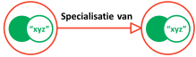 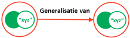

Iedere definitie heeft een duidelijke opbouw, namelijk:

> 'Een {te definiëren begrip} Is een {ander begrip} dat...'.

Bijvoorbeeld in de context van het Kadaster:

> 'Een zakelijk recht is een recht dat..'

Een recht is een typisch voorbeeld van een basisbegrip ofwel een axioma in het model. Dit kan juridisch worden uitgelegd, maar voor een leek zal die niet meer duidelijkheid geven dan het besef dat het bij het Kadaster net als bij elke overheidsorganisatie om het vastleggen en bewaken van rechten en plichten gaat.

Het definiëren van een begrip in termen van een ander begrip kan op twee manieren:

> * Een {begrip} is een {een ander begrip} dat..
>
> * Een {begrip} is een {een ander begrip} of {nog een ander begrip} of..

In het eerste geval gaat het om een specialisatie. In het tweede geval gaat het om een generalisatie. Een voorbeeld van een specialisatie is het hierboven genoemde 'zakelijk recht' dat een specialisatie is van 'recht'. Je moet eerst het begrip 'recht' begrijpen om te begrijpen wat een 'zakelijk recht is'.

Een voorbeeld van een generalisatie is het begrip 'persoon' bij de overheid. Dit is een generalisatie van 'natuurlijke persoon' en 'rechtspersoon'. Een natuurlijk persoon is een mens in zijn juridische betekenis. Juristen formuleren dat dan in de trant van 'in zijn hoedanigheid als drager van rechten en plichten'. Een rechtspersoon is een organisatie, die ook drager van rechten en plichten is. In dit geval moet je eerst de begrippen 'natuurlijk persoon' en 'rechtspersoon' begrijpen om te begrijpen wat een 'persoon' is.

**Bestaat uit en is onderdeel van**

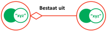 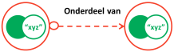

Soms komt het voor dat een bepaald begrip bestaat uit onderdelen van andere begrippen. Deze constructie heeft een opbouw vergelijkbaar met een specialisatie of generalisatie:

> Een {begrip} bestaat uit een {een ander begrip} en een {nog een ander begrip} en..

Een voorbeeld is het begrip 'adres' in de BAG. Dit wordt gedefinieerd als: "Een adres is een .. bestaande uit de naam van een openbare ruimte, een nummeraanduiding en de naam van een woonplaats". Om te begrijpen wat een adres betekent moet je begrijpen wat een 'openbare ruimte' is, wat een 'nummeraanduiding' is en wat een 'woonplaats' is.

Ook het tegenovergestelde komt voor. Een begrip kan onderdeel zijn van een ander begrip. Deze constructie ziet er als volgt uit:

> Een {begrip} is een onderdeel van een {een ander begrip} dat..

Een voorbeeld is het begrip 'vestiging' in het NHR. Dit wordt gedefinieerd als 'Een vestiging is een onderdeel van een maatschappelijke activiteit dat..'. Om dit te begrijpen moet je eerst begrijpen wat een maatschappelijke activiteit is.

**Semantische relatie**

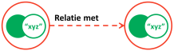

Tot slot kan een begrip betrekking hebben op een ander begrip. Dat heet een semantische relatie. Deze constructie komt vaak voor in combinatie met een specialisatie en ziet er dan als volgt uit:

> Een {begrip} is een {een ander begrip} dat betrekking heeft op {nog een ander begrip}..

Een voorbeeld is het eerder genoemde begrip 'zakelijk recht' bij het Kadaster. De volledige definitie daarvan is 'Een zakelijk recht is een .. recht op een zaak..'. In dit geval moet je ook begrijpen wat een 'zaak' is om het begrip 'zakelijk recht' te begrijpen.

**Intensionele en extensionele definities**

De klassieke definitieleer onderscheidt intensionele en extensionele definities.

* In een intensionele definitie wordt een begrip uitgelegd in termen van een ander begrip met een nadere specificatie. In ons begrippenkader is dat een specialisatie of onderdeel van relatie in combinatie met een of meer semantische relaties.
* In een extensionele definitie wordt een begrip uitgelegd door een opsomming van de voorkomens ervan. In ons begrippenkader is dat een generalisatie of een bestaat uit relatie.

In taxonomieën zijn specialisatie en generalisatie tegenovergesteld, dat wil zeggen als A een specialisatie van B is, is B een generalisatie van A. Dat geldt ook voor de "bestaat uit" relatie en de "onderdeel van" relatie. Als een adres is opgebouwd uit onder andere een straatnaam, dan is een straatnaam onderdeel van een adres. Maar als je het begrip adres definieert als iets dat is opgebouwd uit een straatnaam, huisnummer, etc. en een straatnaam als onderdeel van een adres, leidt dat tot een cirkelredenering. Om cirkelredeneringen te voorkomen volgen we daarom strikt de definitie-volgorde van de bron.

**Bronvermelding**

Het is van belang dat voor elk begrip een bronverwijzing (liefst een juridische) wordt gevonden, waarmee duidelijk wordt welk begrip bedoeld wordt.

### Definities en klare taal

De formele definitie is typisch ontleend aan de wet of aan vakliteratuur. Dit is vaak in een begrippenkader dat alleen door ingewijden in het betreffende jargon is te begrijpen. Daarom is meestal een vertaling naar 'klare taal' nodig om een begrip ook voor niet-ingewijden duidelijk te beschrijven. Klare taal bevat uitsluitend woorden die door 95% van de mensen worden begrepen. Klare taal is altijd expliciet ('klaar'). Het bevat geen impliciete duidingen. Er staat gewoon wat er staat, niets meer en ook niets minder. Bij het uitleggen in klare taal worden de volgende richtlijnen gebruikt:

* Bij het uitleggen van een begrip in klare taal worden dezelfde logische constructies gebruikt als bij de formele definitie, namelijk specialisatie, generalisatie, opgebouwd uit, onderdeel van en semantische relatie.
* Termen die op zich niet klare taal zijn, maar ergens anders binnen het begrippenkader worden uitgelegd, kunnen worden gebruikt in deze logische constructies.
* Alle andere woorden in een uitleg moeten voorkomen in de zogenaamde B1 lijst. Dit is een beperkte woordenlijst die alleen woorden bevat waarvan bekend is dat 95% van alle mensen deze begrijpt.

De klare taal uitleg verbindt vakjargon met het begrippenkader dat we als gewone mensen met elkaar gemeen hebben. Bovendien wordt via het begrip ook de link gelegd met de administratieve registratie.

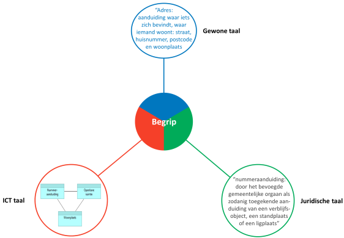

### Vocabulaires

Het volledige profiel voor begrippen is uitgewerkt in [skos applicatieprofiel](http://bp4mc2.org/profiles/#skos-toepassingsprofiel-voor-begrippenkaders). In dit document volstaan we met een opsomming van de gebruikte vocabulaires.

| Vocabulaire | URI | Gebruik
|-------------|-----|---------
| SKOS | http://www.w3.org/2004/02/skos/core# | De beschrijving van begrippen
| RDFS | http://www.w3.org/2000/01/rdf-schema# | Algemene Linked Data eigenschappen
| DCT | http://dublincore.org/documents/dcmi-terms/ | Bronverwijzingen

### Grafische representative

Een triple wordt vaak afgebeeld als een gerichte graaf: twee bolletjes (voorstelling van subject en object) die met elkaar verbonden zijn met een pijl die het 'predicate' voorstelt. Als het object zelf niet gebruikt wordt om verder door te verwijzen (omdat het geen URI is, maar een vaste waarde, een 'literal', dan wordt vaak in plaats van een bolletje een rechthoek gebruikt.

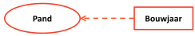

Wij sluiten aan op deze conventie. Daarbij onderscheiden wij verschillende pijlen die de verschillende relaties in het axiomatisch begrippenstelsel representeren. Daarbij hebben we ervoor gekozen om de beeldtaal zo veel mogelijk te laten lijken op UML, om een plaatje te kunnen maken dat herkenbaar is voor de meeste informatici en op hoofdlijnen ook juist begrepen kan worden.

Toch zijn er belangrijke verschillen die tot verwarring kunnen leiden als ons model ook echt als een UML model wordt 'gelezen'. Dit is niet bedoeling. Het begrippenmodel is geen UML, en als de finesses van het model begrippen moeten worden, dan is het belangrijk om de verschillen goed te begrijpen. De belangrijkste verschillen zijn:

* Onderscheid tussen generalisatie-van en specialisatie-van. In UML worden beiden getekend met een ‘IS A’ relatie. Daarmee wordt in UML de omgekeerde (inverse) relatie ook verondersteld.
* Onderscheid tussen onderdeel-van en bestaat-uit. In UML wordt de ‘onderdeel-van’ en ‘bestaat-uit’ relatie altijd getekend als een aggregatie, dus van het geheel naar zijn.

Daarmee komen we tot onderstaande conventies voor een grafische representatie van een axiomatisch begrippenstelsel.

**Gerelateerd aan**

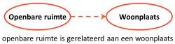

Een gestippelde lijn met pijlpunt geeft aan dat een begrip voor zijn betekenis afhankelijk is van een ander begrip.

**Generalisatie van**

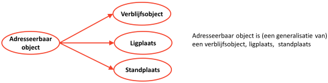

Een vaste lijn met pijlpunt geeft aan dat een begrip een generalisatie is van een ander begrip.

**Specialisatie van**

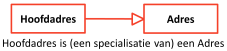

Een vaste lijn met open pijlpunt geeft aan dat een begrip een specialisatie is van een ander begrip.

**Bestaat uit**

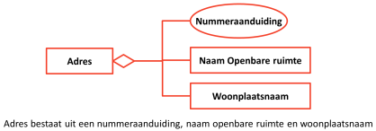

Een vaste lijn met een open ruit geeft aan dat een begrip bestaat uit een ander begrip (open ruit aan de kant van het 'geheel')

**Onderdeel van**

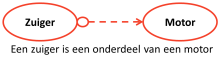

Een gestippelde lijn met pijlpunt en een open bolletje geeft aan dat een begrip onderdeel is van een ander begrip (open bolletje aan de kant van het 'onderdeel')

### Voorbeeld

Een op deze manier uitgewerkt voorbeeld van het model van de BAG is te vinden op http://bag.basisregistraties.overheid.nl/id/begrip/Pand. Dit voorbeeld is beschikbaar als html webpagina, in turtle en als grafische representatie:

* Html en grafisch: https://bag.basisregistraties.overheid.nl/doc/begrip/Pand;
* Turtle: https://bag.basisregistraties.overheid.nl/doc/begrip/Pand?format=ttl;
* JSON-LD: https://bag.basisregistraties.overheid.nl/doc/begrip/Pand?format=json.

Dit voorbeeld laat ook mooi zien hoe de uri-strategie werkt. Wanneer in de browser de 'vraag' http://bag.basisregistraties.overheid.nl/id/begrip/Pand wordt ingetoetst, geeft de achterliggende linked data store "some usefull information" terug via de webpagina https://bag.basisregistraties.overheid.nl/doc/begrip/Pand en toont de bij dit begrip behorende informatie, op een veilige en betrouwbare manier (https):

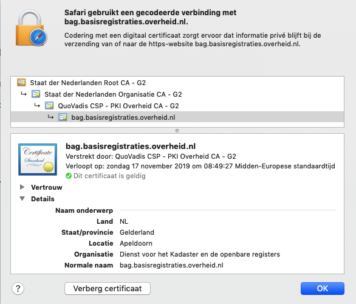

## Gebeurtenissen

### Model

Gebeurtenissen hebben dezelfde kenmerken als begrippen die objecten aanduiden, maar hebben ook nog enkele andere kenmerken. Gebeurtenissen zijn alleen van belang als ze betrekking hebben op een object dat onderdeel uitmaakt van de registratie. Gebeurtenissen maken de dynamiek van een registratie zichtbaar. Om te begrijpen wat er is veranderd in een registratie helpt het om te zien wat er is gebeurd.

Omdat het begrippenkader is gebaseerd op een institutionele bron gaat het daarbij nog steeds om institutionele gebeurtenissen, bijvoorbeeld rechtshandelingen. Deze hebben altijd een aanleiding in de natuurlijke werkelijkheid. Institutionele gebeurtenissen zijn, zoals in de denkwijze aangegeven, onderdeel van de institutionele werkelijkheid en kennen daarmee vaak één of meerdere actoren, bijvoorbeeld de verkoper en de koper bij de overdracht van een huis. En niet iedereen is bevoegd om een institutionele gebeurtenis vast te leggen. Dat gebeurt door een beëdigd ambtenaar of door een notaris. Dit wordt een 'agent' (in de Engelse betekenis van het woord) genoemd. Tot slot zijn er de regels waaraan voldaan moet zijn voordat het feit kan plaatsvinden, de voorwaarde en de regels waaraan het resultaat van de gebeurtenis voldoet, de eindsituatie.

**Gebeurtenis en handeling**

Bij het definiëren van gebeurtenissen worden de volgende richtlijnen gebruikt:

* Een gebeurtenis hangt sterk samen met een handeling (in het engels een 'Act'). Een handeling kan beschreven worden met een werkwoord, bijvoorbeeld x 'betaalt' y. Een gebeurtenis kan worden beschreven met een verzelfstandigd werkwoord, bijvoorbeeld 'Het betalen'. Of als handeling: 'Betalen rekening' (dan is ook gelijk duidelijk waarop het werkwoord betrekking heeft). Voor gebeurtenissen geldt dat de nadruk niet ligt op de handeling ('Het betalen'), maar op de overgang van beginsituatie (aanleiding+voorwaarde) naar eindsituatie. Dit zijn vaak woorden die eindigen op 'ing' (hoewel dat niet altijd zo hoeft te zijn). In dit geval dus: 'De betaling' (De gebeurtenis bij het overdragen is niet overdraging, maar overdracht). Dit staat bekend onder het substantiveren van werkwoorden. Grappig is dat dit niet werkt voor werkwoorden die niet leiden tot een resultaat. Het lukt bijvoorbeeld niet voor 'lopen': de handeling lukt nog wel ('het lopen'), maar de gebeurtenis niet.
* Daarnaast wordt ook voor een gebeurtenis de definitievorm "een {gebeurtenis} is {uitleg}" gehanteerd. Dan worden weer werkwoorden gebruikt in de definitie die algemener zijn dan in de gebeurtenis. Ook hier ontstaat dus uiteindelijk een axiomatisch begrippenstelsel van gebeurtenissen.
* De aanleiding wordt altijd beschreven met een voltooid deelwoord, bijvoorbeeld 'koper en verkoper zijn overeengekomen dat een bepaald zakelijk recht wordt verkocht'.
* De voorwaarde wordt beschreven met een werkwoord in de tegenwoordige tijd. Bijvoorbeeld 'de verkoper is eigenaar'. 'De levering gebeurt per notariële akte, die aan de volgende voorwaarden ... voldoet'.
* Ook de eindsituatie wordt beschreven in termen van een voltooid deelwoord, bijvoorbeeld 'de koper is eigenaar geworden'.
* Aanleiding, voorwaarde en eindsituatie worden opgenomen als onderdeel van de toelichting op de definitie, zoals bij "normale" begrippen.

**Actor**

Een actor is degene die betrokken is bij de handeling. In het geval van gebeurtenissen waarbij geen sprake is van een actor (bijvoorbeeld het verlopen van een vergunning) is ook geen sprake van een handeling. Er kunnen meerdere actoren betrokken zijn bij de handeling. De beschrijving van de betreffende actor geeft dan aan hoe deze actor een rol speelt. Bijvoorbeeld:

>* Een hypotheekgever is de schuldenaar die als zekerheid een recht van hypotheek geeft op zijn registergoed
>
>* De Hypotheeknemer is de schuldeiser die een recht van hypotheek heeft op het registergoed van de hypotheekgever

Overigens geeft dit voorbeeld gelijk aan hoe een begrippenkader bij kan dragen aan meer begrip. Velen zullen een 'hypotheek' zien als synoniem voor een 'hypotheeklening'. Dit zijn echter twee volledig andere begrippen. Waar bij een hypotheeklening de bank degene is die een lening "geeft", is het bij een recht van hypotheek juist degene die de lening krijgt, de hypotheekgever. Zo "krijgt" de hypotheekgever zijn lening feitelijk in ruil voor een recht op hypotheek.

Uit de definities blijkt dat een hypotheekgever een specialisatie is van een schuldenaar, wat weer een specialisatie is van persoon. En zo is hypotheeknemer een specialisatie van schuldeiser, wat ook weer een specialisatie is van een persoon. Toch moet opgepast worden om op deze wijze een taxonomie (ordening) van personen op te stellen. Hypotheekgevers, hypotheeknemers, schuldenaars en schuldeisers zijn rollen van een persoon. Deze zijn alleen geldig in de context van de handeling. Zo'n indeling van personen is dan ook alleen geldig in deze context. Vandaar dat we deze begrippen speciaal typeren als `skos-lex:Actor`. Voor een stabiele taxonomie is het beter om gebruik te maken van een ordening die niet context-gevoelig is, maar gebaseerd is op de intrinsieke eigenschappen van de begrippen, zoals bijvoorbeeld de taxonomie van dieren zoals in de hedendaagse biologie gebruikelijk [[BIOTAX]].

Een voorbeeld van een taxonomie waar juist veel rollen in worden gebruikt (en dan ook gezien wordt als voorbeeld van een foute taxonomie), is de (mogelijk fictieve) Celestial Emporium of Benevolent Knowledge [[CELEMP]]

**Agent**

Een agent is een speciaal soort actor die wel betrokken is bij een handeling, maar er niet "echt" aan meedoet. Een voorbeeld hiervan is een ambtenaar van de burgelijke stand. Zonder deze ambtenaar kan er van een huwelijk geen sprake zijn. Toch wordt de ambtenaar niet in de echt verbonden: alleen de twee gehuwden zijn actoren in de handeling. De ambtenaar is slechts agent, en zorgt ervoor dat een levensgebeurtenis ook gezien wordt in de institutionele werkelijkheid.

**Object**

Een object betreft een begrip dat betrekking heeft op iets dat niet handelt in de handeling, maar duidelijk we het object is van de handeling. In bovengenoemd voorbeeld was het recht van hypotheek het object van handelen. Overigens kan een persoon wel het object zijn in een handeling, als het bijvoorbeeld "over" hen gaat, maar niet "met" hen.

### Vocabulaires

Het volledige profiel voor begrippen is uitgewerkt in [skos-lex applicatieprofiel](http://bp4mc2.org/profiles/#skos-lex-toepassingsprofiel-voor-rechts-handelingen). In dit document volstaan we met een opsomming van de gebruikte vocabulaires.

| Vocabulaire | URI | Gebruik
|-------------|-----|---------
| SKOS | http://www.w3.org/2004/02/skos/core# | De beschrijving van begrippen
| RDFS | http://www.w3.org/2000/01/rdf-schema# | Algemene Linked Data eigenschappen
| DCT | http://dublincore.org/documents/dcmi-terms/ | Bronverwijzingen
| SKOS-LEX | http://bp4mc2.org/def/skos-lex# | Aanvullingen voor het beschrijven van handelingen

### Voorbeeld

Een op deze manier uitgewerkt voorbeeld van het model van de BRK is te vinden op http://brk.basisregistraties.overheid.nl/id/begrip/Overdracht_eigendom. Ook dit voorbeeld is beschikbaar in turtle, als html webpagina en als grafische representatie.

## Datamodel

De registratie zelf bevat data. Deze wordt vastgelegd conform een datamodel waarin dataklassen, eigenschappen e.d. worden beschreven. Dat kan een klassiek relationeel datamodel zijn dat typisch wordt vastgelegd in UML, bijvoorbeeld conform het best-practices metamodel. Het kan ook een ontologie zijn die één op één uitwerking is van het begrippenmodel.

Een datamodel verbindt over het algemeen een structuur met de termen die verwijzen naar een specifieke betekenis. In veel traditionele datamodellen wordt deze specifieke betekenis niet verder uitgemodelleerd. Het blijft bij het benoemen van de term, en in bepaalde gevallen het toevoegen van een voor mensen leesbare definitie.

UML class diagrams worden vaak gebruikt voor het beschrijven van datamodellen. In dergelijke gevallen kan in een UML class diagram een class wordt geinterpreteerd conform object-georienteerde principes: een class met methoden en eigenschappen, die instanties kunnen hebben die dan deze methoden en eigenschappen hebben. De UML class specificatie kan ook gebruikt worden bij het beschrijven van een datastructuur, bijvoorbeeld in de vorm van een relationele tabel of de structuur van een XML bericht (een XSD).

In dit document richten we ons op die datamodellen die de structuur van de data beschrijven, inclusief een volledige verwijzing naar de semantiek van de termen die daarbij gebruikt worden. Om dit voor elkaar te krijgen, is de best practice om daarbij gebruik te maken van drie recommendations die door de W3c zijn uitgegeven:

1. RDFS/OWL voor het formeel (machine-leesbaar) beschrijven van de semantiek van termen die verwijzen naar classes en properties;
2. SKOS voor het informeel (leesbaar voor mensen) beschrijven van de semantiek van termen;
3. SHACL voor het formeel (machine-leesbaar) beschrijven van de structuur waarin bovengenoemde termen gebruikt kunnen worden.

Een van de voordelen van UML (en een nadeel van bovengenoemde recommendations) is het grafisch kunnen tonen van het datamodel. Daarvoor stellen we in dit document een grafische weergave voor die een datamodel kan weergevan dat gebaseerd is op bovengenoemde recommendations.

De bovengenoemde recommendations kunnen met elkaar worden verbonden door middel van enkele properties die inmiddels algemeen voor dit doel worden ingezet, zoals afgebeeld in onderstaand figuur.

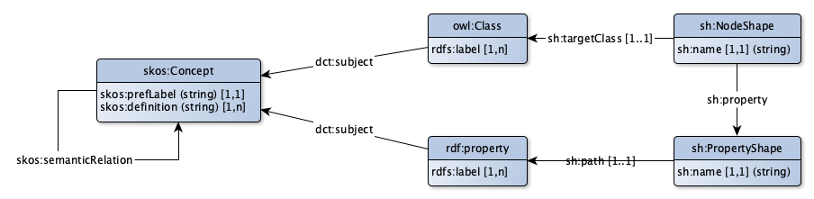

Merk op dat in dit figuur niet alle elementen zijn afgebeeld. Details zijn te vinden in de betreffende profielen [skos-ap-sc](http://bp4mc2.org/profiles/#skos-toepassingsprofiel-voor-begrippenkaders) en [dm-ap-sc](http://bp4mc2.org/profiles/#dm-toepassingsprofiel-voor-informatiemodellen). De rationale voor de keuze op `dct:subject` te gebruiken als link tussen de ontologie en het begrippenkader kan gevonden worden in [[SKOSOWL]].

### Vertaling begrippenkader naar een relationeel datamodel

Het begrippenkader is bruikbaar om met domeineigenaren en data afnemers te communiceren over de inhoud van een registratie. Het vertalen van dit begrip naar een samenhangend datamodel is het werkveld van de data architect. Een datamodel kan worden opgevat als een ontwerp van een structuur waarin data over de begrippen in het semantische model kunnen worden opgeslagen. Het Metamodel voor Informatiemodellen [[MIM]] is een metamodel voor een relationeel model dat is gebaseerd op het metamodel dat is ontwikkeld in de werkgroep 'best practices basisregistraties'. Het model bevat objectklassen, attribuutklassen, gegevensgroepen (een set samenhangende attribuutklassen) en relatieklassen.

Met behulp van bovengenoemde recommendations wordt een klassiek relationeel model dat is gemaakt op basis van het MiM één op één vertaald naar een rdf beschrijving. Het model blijft natuurlijk gewoon relationeel, maar de beschrijving van de data (in UML de 'classes') in het relationele systeem komt hiermee beschikbaar als linked data en kan daardoor worden verbonden met de beschrijving van andere data.

Een op deze manier uitgewerkt voorbeeld van het model van de BRK is te vinden via de eigenschap http://bag.basisregistraties.overheid.nl/def/bag#hoofdadres. Dit voorbeeld is beschikbaar als html webpagina, in turtle en als grafische representatie.

Dit voorbeeld laat ook mooi zien hoe de uri-strategie voor het beschrijven van een datamodel werkt. Het intypen van bovenstaande URL zal leiden tot de weergave van de pagina https://bag.basisregistraties.overheid.nl/def/bag (het deel voor de "#"). Met andere woorden: de beschrijving van de ontologie van de bag.

Vanuit deze ontologie kan ook de structuur van het datamodel bekeken worden, bijvoorbeeld voor de beschrijving van de structuur van een Verblijfsobject: [http://bag.basisregistraties.overheid.nl/def/bag/Verblijfsobject](https://bag.basisregistraties.overheid.nl/resource?subject=http%3A%2F%2Fbag.basisregistraties.overheid.nl%2Fdef%2Fbag%23Verblijfsobject).

### Metadata

Metadata gaan over pragmatische zaken zoals de wijze waarop data worden ingewonnen, de kwaliteit (tijdigheid, betrouwbaarheid en volledigheid) en de status (authenticiteit) van data die over ‘het ding dat met een begrip wordt aangeduid’ worden vastgelegd. Metadata zijn nodig om reikwijdte en bruikbaarheid van data beter te begrijpen.

Metadata kunnen op verschillende niveaus worden vastgelegd. Metadata kan betrekking hebben op alle data van een bepaald type in de registratie, op data van een bepaald type die zijn verzameld gedurende een bepaalde periode maar ook op specifieke data. Het metagegeven 'wijze van inwinning' wordt meestal per data-element gedefinieerd. Kwaliteitsmetingen kunnen worden gebaseerd op een audit over een bepaalde periode. En de BAG kent bijvoorbeeld het element 'gebaseerd op proces verbaal'. Dat betekent dat data over een specifiek object zijn geconstateerd door iemand die ter plekke is gaan kijken en de administratieve werkelijkheid in overeenstemming heeft gebracht met natuurlijke werkelijkheid.

### Waardelijsten

Een speciale categorie waarin informatie over begrippen wordt vastgelegd betreft waardelijsten. Waarden zijn termen die bepaalde, samenhangende begrippen aanduiden waaraan in verschillende toepassingen en soms zelfs bij verschillende organisaties wordt gerefereerd. Soms worden dit daarom ook referentiedata genoemd.

Elementen in een waardelijst worden stuk voor stuk aangeduid met een begrip in het begrippenkader. Een voorbeeld uit de BAG is het 'gebruiksdoel' van een 'pand'. Dat kan 'wonen', 'winkel', 'kantoor', et cetera zijn. Semantisch betekent dit dat er verschillende soorten panden zijn, namelijk woonhuizen, winkels en kantoren. Om het datamodel overzichtelijk te houden is in de BAG de ontwerpkeuze gemaakt om 1 objecttype te definiëren. Dit heeft als attribuuttype 'gebruiksdoel', dat de waarden "wonen", "winkel", "kantoor", et cetera in de waardelijst kan aannemen. Bijkomend voordeel is dat het datamodel niet hoeft te worden aangepast als er een gebruiksdoel bij komt. Dan hoeft alleen maar een nieuw element aan de waardelijst te worden toegevoegd.

In klassieke datamodellen wordt geen onderscheid gemaakt tussen de verschillende soorten van waardelijsten. Toch kunnen we enkele soorten onderkennen die feitelijk een geheel eigen betekenis hebben:

1. Waardelijsten die betrekking hebben op soorten, typen, etc. Dit betreffen waardelijsten met begrippen zoals hierboven vermeld;
2. Waardelijsten die betrekking hebben op elementen die feitelijk "gewoon" data zijn, maar buiten het beheer van de originele databron vallen. Dit betreffen waardelijsten als "de lijst met landen", of "de lijst met automerken";
3. Waardelijsten die de mogelijke waarden van een veld beperken, bv. "`I`", "`II`", "`III`", zonder dat daarbij extra betekenis wordt toegekend aan de waarde zelf.

Type-3 waardelijsten zien we als specifieke structuurbeperkingsregels en niet "echt" als waardelijsten. Type-2 waardelijsten zien we, vanuit datamodel optiek, "gewoon" als een eigen klasse met instanties. Een meer uitgebreidere toelichting is opgenomen in de bijlage: http://bp4mc2.org/modeling/value-lists/.

### Grafische representatie

**Klasse: sh:NodeShape met owl:Class**

Een owl:Class wordt samen met een sh:NodeShape afgebeeld als een rechthoek met bovenin de naam van de klasse (inclusief prefix), en onderin de eigenschappen die voor deze owl:Class conform de sh:NodeShape zijn toegestaan. Zowel attributen (eigenschappen met een datatype) als relaties (eigenschappen die verwijzen naar een andere owl:Class) kunnen daarbij getoond worden. Het datatype van een attribuut wordt tussen haakjes getoond. Een relatie naar een andere klasse wordt getoond door middel van een pijl. Een relatie wordt alleen in de rechthoek getoond, als de gerelateerde klasse niet zelf ook als rechthoek in het diagram staat. De cardinaliteit wordt getoond door middel van blokhaken, volgens het template `[{minimum},{maximum}]`.

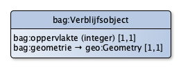

Bovenstaand figuur is de visualisatie van onderstaande Linked Data specificatie:

```
  bagshape:Verblijfsobject a sh:NodeShape;
    sh:targetClass bag:Verblijfsobject;
    sh:name "bag:Verblijfsobject";
    sh:property bagshape:Verblijfsobject_oppervlakte;
    sh:property bagshape:Verblijfsobject_geometrie;
  .
  bagshape:Verblijfsobject_oppervlakte;
    sh:path bag:oppervlakte;
    sh:name "bag:oppervlakte";
    sh:datatype xsd:integer;
    sh:minCount 1;
    sh:maxCount 1;
  .
  bagshape:Verblijfsobject_geometrie;
    sh:path bag:geometrie;
    sh:name "bag:geometrie";
    sh:class geo:Geometry;
    sh:minCount 1;
    sh:maxCount 1;
  .
```

**Subclassificatie**

Om aan te geven dat een klasse een subklasse is van een andere klasse, wordt gebruik gemaakt van een pijl die eindigt met een witte driehoek.

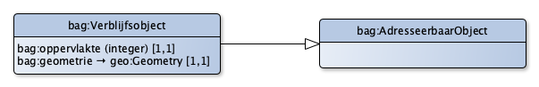

De subclassificatie uit bovenstaand figuur is de visualisatie van onderstaande Linked Data specificatie:

```
  bag:Verblijfsobject a owl:Class;
    rdfs:subClassOf bag:AdresseerbaarObject;
  .
```

**Rol: sh:NodeShape zonder owl:Class**

In bepaalde gevallen is het belangrijk om aan te geven dat een bepaalde structuur wordt verwacht van een instantie van een bepaalde klasse, zonder dat sprake is van subclassificatie in formele zin. Je zou kunnen zeggen dat in zo'n geval sprake is van een specifieke "rol" die vervult wordt door instanties die aan deze shape moeten voldoen. Hiervoor wordt gebruik gemaakt van een pijl die eindigt met een witte driehoek, met een onderbroken lijn. De rechthoek bevat daarbij de naam van de rol, met tussen haakjes de naam van de klasse.

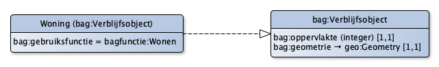

De rol-relatie (en de beschrijving van Woning) uit bovenstaand figuur is de visualisatie van onderstaande Linked Data specificatie:

```
  bagshape:Woning a sh:NodeShape;
    sh:property [
      sh:path rdf:type;
      sh:hasValue bag:Verblijfsobject;
    ];
    sh:property bagshape:Woning_gebruiksfunctieWoning;
  .
  bagshape:Woning_gebruiksfunctieWoning a sh:PropertyShape;
    sh:property [
      sh:path bag:gebruiksfunctie;
      sh:name "bag:gebruiksfunctie";
      sh:hasValue bagfunctie:Wonen
    ]
  .
```

In dit voorbeeld is ook getoond hoe aangegeven kan worden dat een bepaalde eigenschap een specifieke waarde moet hebben.

**Attributen en relaties**

In bovenstaande voorbeelden kwamen attributen en relaties eigenlijk al aan bod. Een attribuut betreft een eigenschap met een datatype (`sh:datetype`). Een relatie betreft een eigenschap die gerelateerd is aan een andere klasse: `sh:class`. Indien deze klasse ook in het figuur voorkomt, dan wordt de relatie als pijl tussen twee rechthoeken afgebeeld.

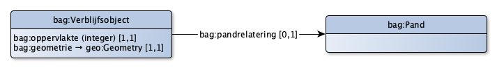

De relaties uit bovenstaand figuur is de visualisatie van onderstaande Linked Data specificatie:

```
  bagshape:Verblijfsobject_pandrelatering a sh:PropertyShape;
    sh:property [
      sh:path bag:pandrelatering;
      sh:name "bag:pandrelatering";
      sh:class bag:Pand;
      sh:maxCount 1;
    ]
  .
```

Soms is het wenselijk om een relatie te leggen naar een rol, dwz: een sh:NodeShape zonder een owl:Class. In dat geval kan geen gebruik worden gemaakt `sh:class`, maar kan gebruik worden gemaakt van `sh:node`:

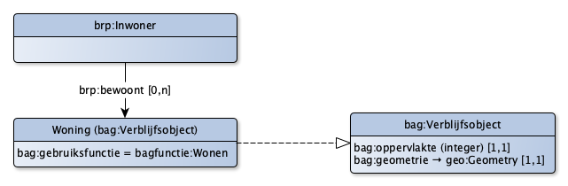

Dit voorbeeld geeft aan dat de relatie van een `brp:Persoon` naar een `bag:Verblijfsobject` alleen mag, indien dit verblijfsobject een woning betreft. Bovenstaande is een visualisatie van de volgende Linked Data specificatie:

```
  brpshape:Persoon_bewoont a sh:PropertyShape;
    sh:property [
      sh:path brp:bewoont;
      sh:name "brp:bewoont";
      sh:node bagshape:Woning;
    ];
  .
```

**Attribuutgroepen**

In datamodellen komen soms attribuutgroepen voor: complexe attributen die alleen gezamenlijk betekenis hebben. In Linked Data zou een dergelijke groep als een blank node gemodelleerd kunnen worden. Dergelijke attribuutgroepen worden afgebeeld met behulp van een zwarte ruit aan het begin van de pijl:

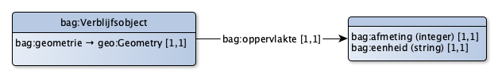

Bovenstaand figuur betreft de visualisatie van de onderstaande Linked Data specificatie:

```
  bagshape:Verblijfsobject_oppervlakte a sh:PropertyShape;
    sh:path bag:oppervlakte;
    sh:name "bag:oppervlakte";
    sh:minCount 1;
    sh:maxCount 1;
    sh:nodeKind sh:BlankNode;
    sh:node [
      sh:property bagshape:Oppervlakte_oppervlakte;
      sh:property bagshape:Oppervlakte_eenheid;
    ]
  .
  bagshape:Oppervlakte_oppervlakte a sh:PropertyShape;
    sh:path bag:oppervlakte;
    sh:name "bag:oppervlakte";
    sh:datatype xsd:integer;
    sh:minCount 1;
    sh:maxCount 1;
  .
  bagshape:Oppervlakte_eenheid a sh:PropertyShape;
    sh:path bag:eenheid;
    sh:name "bag:eenheid";
    sh:datatype xsd:string;
    sh:minCount 1;
    sh:maxCount 1;
  .
```

**Waardelijsten**

In het vorige voorbeeld werd een eenheid geïntroduceerd als een string (zoals "m", "cm", "km"). Beter zou in dit geval zijn om een waardelijst te introduceren met meeteenheden. En omdat in dit geval de meeteenheden beperkt kunnen blijven tot meters en centimeters, heeft het toegevoegde waarde om de waardelijst ook daadwerkelijk grafisch af te beelden. Onderstaand figuur geeft dit weer.

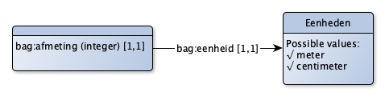

Deze visualisatie is gebaseerd op onderstaande Linked Data specificatie:

```
  bagshape:Oppervlakte_eenheid a sh:PropertyShape;
    sh:path bag:eenheid;
    sh:name "bag:eenheid";
    sh:node bagshape:Eenheden;
    sh:minCount 1;
    sh:maxCount 1;
  .
  bagshape:Eenheden a sh:NodeShape;
    sh:name "Eenheden";
    sh:property [
      sh:path skos:inScheme;
      sh:hasValue bag:Eenheden
    ];
  .
  bag:Eenheden a skos:ConceptScheme.
  bagbegrip:Meter a skos:Concept;
    skos:prefLabel "meter";
    skos:inScheme bag:Eenheden;
  .
  bagbegrip:Centimeter a skos:Concept;
    skos:prefLabel "centimeter";
    skos:inScheme bag:Eenheden;
  .
```

### Voorbeeld

Een voorbeeld van een datamodel gebaseerd op deze opzet is te vinden bij de [profielen](http://bp4mc2.org/profiles). Elk van de profielen kent een grafische representatie die gebaseerd is op een SHACL en RDFS/OWL model. Deze SHACL en RDFS/OWL modellen zijn te vinden op https://github.com/bp4mc2/bp4mc2/tree/master/profiles.
